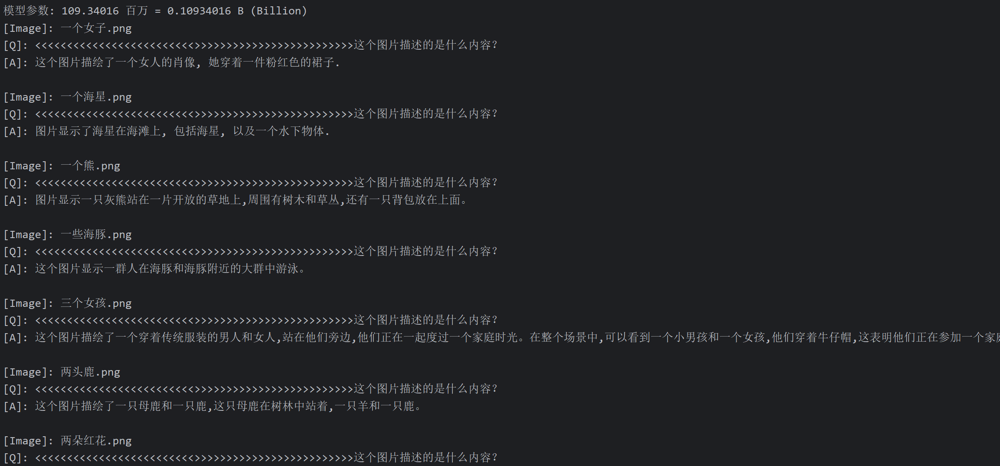

<div align="center">


</div>


<div align="center">


[](https://github.com/jingyaogong/minimind-v/stargazers)
[](LICENSE)
[](https://github.com/jingyaogong/minimind-v/commits/master)
[](https://github.com/jingyaogong/minimind-v/pulls)
[](https://huggingface.co/collections/jingyaogong/minimind-v-67000833fb60b3a2e1f3597d)

</div>

<div align="center">
  <h3>"大道至简"</h3>
</div>

<div align="center">

中文 | [English](./README_en.md)

</div>

* 本开源项目旨在从0开始，最快3小时训练一个小参数量的，具备视觉模态能力的语言模型**MiniMind-V**
* **MiniMind-V**同样极其轻量，最小版本体积仅为 GPT3 的约 $\frac{1}{7000}$，力求做到个人GPU也可快速推理甚至训练。
* 这不仅是一个开源模型的实现，也是入门视觉语言模型（VLM）的教程。
* 希望此项目能为研究者提供一个抛砖引玉的入门示例，帮助大家快速上手并对VLM领域产生更多的探索与创新。

  > 为防止误读，「从0开始」特指基于纯语言模型MiniMind（这是一个完全从0训练的类GPT模型）做进一步的，从0到1的视觉能力拓展。
  > 若需详细了解后者，请参考孪生项目[MiniMind](https://github.com/jingyaogong/minimind)。

  > 为防止误读，「最快3小时」是指您需要具备＞本人硬件配置的机器，具体规格的详细信息将在下文提供。


<div align="center">

Demo已部署至ModelScope创空间，可以在此网站上体验：

[ModelScope在线体验](https://modelscope.cn/studios/gongjy/minimind-v)

[🎉🎉BiliBili项目视频🎉🎉](https://www.bilibili.com/video/BV1Sh1vYBEzY)
</div>

# 📌 Introduction

视觉语言模型（VLM）如 GPT-4V、Qwen-VL、LlaVA 等，虽然在效果上令人惊艳，
但这些动辄 100 亿级参数的庞大模型，往往需要极高的硬件配置。
对于个人设备来说，不仅显存远远不足以支持训练，甚至连推理都十分困难。
我们通过阅读论文或公众号讲解来了解略显新颖的 VLM，
往往只能一知半解云里雾里。
而我们真正需要了解的是：
构建多模态大模型是否真的如想象中那样复杂？它的代码实现到底如何？
训练过程究竟难不难？如果我只有一张 2080Ti 显卡，能否从0开始进行训练？

通过 **MiniMind-V**，本项目希望回答这些问题，
帮助研究者在有限的硬件条件下理解视觉语言模型的核心原理。

> [!TIP]
> （截至2024-10-04）MiniMind-V 系列已完成了 2 个型号模型的预训练，最小仅需27M（0.027B），即可具备识图和对话的能力！

| 模型 (大小)                   | tokenizer长度 | 推理占用   | release    | 主观评分（/100） | 
|---------------------------|-------------|--------|------------|------------|
| minimind-v-v1-small (27M) | 6400        | 0.6 GB | 2024.10.04 | 50'        |
| minimind-v-v1 (109M)      | 6400        | 1.1 GB | 2024.10.04 | 60'        |

> 该分析在具有Torch 2.1.2、CUDA 12.2和Flash Attention 2的2×RTX 3090 GPU上进行。

### 👉**最近更新**

<details close> 
<summary> <b>2024-10-05 (newest 🎉)</b> </summary>

- MiniMind-V如期而至，首次开源

</details>

# 📌 Environment

仅是我个人的软硬件环境配置，自行酌情变动：

```bash
CPU: Intel(R) Core(TM) i9-10980XE CPU @ 3.00GHz
内存：128 GB
显卡：NVIDIA GeForce RTX 3090(24GB) * 2
环境：python 3.9 + Torch 2.1.2 + DDP单机多卡训练
```

* Ubuntu == 20.04
* Python == 3.9
* Pytorch == 2.1.2
* CUDA == 12.2
* [requirements.txt](./requirements.txt)

# 📌 Quick Start Test

> BTW: 如果没有git-lfs，请先安装 `sudo apt-get update`, `sudo apt-get install git-lfs`

* 0.克隆项目
    ```bash
    git clone https://github.com/jingyaogong/minimind-v 
    cd minimind-v
    ```

* 1.环境安装
  ```bash
  pip install -r requirements.txt -i https://pypi.tuna.tsinghua.edu.cn/simple
  ```

  ```text
  # 测试torch是否可用cuda
  import torch
  print(torch.cuda.is_available())
  ```

  > 如果不可用，请自行去[torch_stable](https://download.pytorch.org/whl/torch_stable.html)
  下载whl文件安装。参考[链接](https://blog.csdn.net/weixin_45456738/article/details/141029610?ops_request_misc=&request_id=&biz_id=102&utm_term=%E5%AE%89%E8%A3%85torch&utm_medium=distribute.pc_search_result.none-task-blog-2~all~sobaiduweb~default-2-141029610.nonecase&spm=1018.2226.3001.4187)


* 2.下载预训练的模型权重文件到项目根目录 `minimind-v-v1`
    ```bash
    git clone https://huggingface.co/jingyaogong/minimind-v-v1
    ```

* 3.下载预训练的`clip-vit-base-patch32` 模型，在 `model/clip_model` 目录下：
    ```bash
    cd model/clip_model 
    git clone https://hf-mirror.com/openai/clip-vit-base-patch32
    ```

* 4.启动聊天网页测试对话
    ```bash
    python web_server.py
    ```


# 📌 Quick Start Train

> BTW: 如果没有git-lfs，请先安装 `sudo apt-get update`, `sudo apt-get install git-lfs`

* 0.克隆项目代码
    ```text
    git clone https://github.com/jingyaogong/minimind-v & cd minimind-v
    ```

* 1.环境安装
  ```bash
  pip install -r requirements.txt -i https://pypi.tuna.tsinghua.edu.cn/simple
  ```

  ```text
  # 测试torch是否可用cuda
  import torch
  print(torch.cuda.is_available())
  ```

  > 如果不可用，请自行去[torch_stable](https://download.pytorch.org/whl/torch_stable.html)
  下载whl文件安装。参考[链接](https://blog.csdn.net/weixin_45456738/article/details/141029610?ops_request_misc=&request_id=&biz_id=102&utm_term=%E5%AE%89%E8%A3%85torch&utm_medium=distribute.pc_search_result.none-task-blog-2~all~sobaiduweb~default-2-141029610.nonecase&spm=1018.2226.3001.4187)

* 2.下载 `clip-vit-base-patch32` 模型，放到 `./model/clip_model` 目录下：
    ```bash
    cd ./model/clip_model & git clone https://hf-mirror.com/openai/clip-vit-base-patch32
    ```

* 3.如果需要自己训练

    * 3.1 下载数据集 ([百度网盘](https://pan.baidu.com/s/1Nz36OBBvVBGEx-PwIb7ofg?pwd=6666)
      or [HuggingFace](https://huggingface.co/datasets/jingyaogong/minimind-v_dataset))文件到`./dataset`
      目录下，并解压`pretrain_images.zip` 和 `sft_images.zip`
    * 3.2 在`./model/LMConfig.py` 中调整model的参数配置
      > 这里仅需调整dim和n_layers参数，分别是`(512+8)`或`(768+16)`，对应于`minimind-v-v1-small`和`minimind-v-v1`
    * 3.3 下载minimind语言模型的预训练权重([百度网盘](https://pan.baidu.com/s/1LE1SPoPYGS7VNtT1tpf7DA?pwd=6666)
      or [HuggingFace](https://huggingface.co/datasets/jingyaogong/minimind-v_dataset/tree/main/out))，放到`./out/`
      目录下，命名为`*_llm.pth`
    * 3.4 `python 1-pretrain_vlm.py` 执行预训练，得到 `*_vlm_pretrain.pth` 作为预训练的输出权重
    * 3.5 `python 2-sft_vlm.py` 执行指令微调，得到 `*_vlm_sft.pth` 作为指令微调的输出权重

* 4.测试自己训练的模型推理效果
    * 确保需要使用的，训练完成的参数权重`*.pth`文件位于`./out/`目录下
    * 也可以直接下载使用我已经训练好的 `*.pth` [权重文件](https://pan.baidu.com/s/1LE1SPoPYGS7VNtT1tpf7DA?pwd=6666)使用
       ```text
      minimind-v/out
      ├── 512_llm.pth
      ├── 512_vlm_pretrain.pth
      ├── 512_vlm_sft.pth
      ├── 768_llm.pth
      ├── 768_vlm_pretrain.pth
      ├── 768_vlm_sft.pth
      ```
    * `python 3-eval_chat.py`测试模型的对话效果，其中测试图片在`./dataset/eval_images`下，可自行更换
      

🍭 【Tip】预训练和全参指令微调pretrain和sft均支持多卡加速

* 单机N卡启动训练(DDP)
  ```bash
  torchrun --nproc_per_node N 1-pretrain_vlm.py
  # and
  torchrun --nproc_per_node N 2-sft_vlm.py
  ```

* 记录训练过程
    ```bash
    torchrun --nproc_per_node N 1-pretrain_vlm.py --use_wandb
    # and
    python 1-pretrain_vlm.py --use_wandb
    ```
  通过添加`--use_wandb`参数，可以记录训练过程，训练完成后，可以在wandb网站上查看训练过程。通过修改`wandb_project`
  和`wandb_run_name`参数，可以指定项目名称和运行名称。

# 📌 VLM Detail

MiniMind-V (VLM)的基座语言模型MiniMind (LLM)来自孪生项目[minimind](https://github.com/jingyaogong/minimind)，
具体的模型结构、训练细节、原理、测试效果等均可移步[minimind](https://github.com/jingyaogong/minimind)项目查阅。
此处为减少冗余，省略讨论LLM的相关部分，默认您已对MiniMind (LLM)的细节有基本的了解。

> PS: 即使您不希望了解MiniMind (LLM)的细节，也可直接参考Quick Test和Quick Start中快速测试或训练MiniMind-V，
> 这并不受太大影响。

MiniMind-V的结构几乎不变，仅增加Visual Encoder和特征投影两个子模块，增加模态混合分支，以支持多种模态信息的输入：


此时，不妨思考2个很有意思的问题：什么叫做**L**arge **L**anguage **M**odel(LLM)？什么叫做多模态模型？

* [这篇文章](https://www.jiqizhixin.com/articles/2024-09-15-3)完美吐露了本人的想法，即LLM这个命名很不准确！

  > 大语言模型（LLM）名字虽然带有语言二字，但它们其实与语言关系不大，这只是历史问题，更确切的名字应该是自回归 Transformer
  或者其他。
  LLM 更多是一种统计建模的通用技术，它们主要通过自回归 Transformer 来模拟 token 流，而这些 token
  可以代表文本、图片、音频、动作选择、甚至是分子等任何东西。
  因此，只要能将问题转化为模拟一系列离散 token 的流程，理论上都可以应用 LLM 来解决。
  实际上，随着大型语言模型技术栈的日益成熟，我们可能会看到越来越多的问题被纳入这种建模范式。也就是说，问题固定在使用 LLM
  进行『下一个 token 的预测』，只是每个领域中 token 的用途和含义有所不同。

* [李玺老师](https://person.zju.edu.cn/xilics#694283)的公开讲话同样佐证了类似观点（原话大意如下）：

  > 文本、视频、语音、动作等在人类看来属于「多模态」信号，但所谓的「模态」其实只是人类在信息存储方式上的一种分类概念。
  就像`.txt`和`.png`文件，虽然在视觉呈现和高级表现形式上有所不同，但它们本质上并没有根本区别。
  之所以出现「多模态」这个概念，仅仅是因为人类在不同的感知层面上对这些信号的分类需求。
  然而，对于机器来说，无论信号来自何种「模态」，最终它们都只是以一串二进制的「单模态」数字序列来呈现。
  机器并不会区分这些信号的模态来源，而只是处理和分析这些序列背后所承载的信息内容。

---

私以为，**G**enerative **P**retrained **T**ransformer (GPT) 比 **L**arge **L**anguage **M**odel (LLM)更为贴切，
因此本人表达上更习惯用"GPT"去代表LLM/VLM/类GPT架构的系列模型，而非为了蹭OpenAI的热度。

---

至此，我们可以用一句话总结GPT的所作所为：
GPT模型根据现有token预测输出下一个下下一个下下下一个token ...，直到模型输出结束符；此处的"token"其实并不需要一定是文本！

---

* 对于LLM模型，如果需要理解"图片"，我们只要把"图片"作为对一种特殊的从来没见过的"外国语言"，通过"外语词典"翻译后即可作为特殊的语言输入LLM
* 对于LLM模型，如果需要理解"音频"，我们只要把"音频"作为对一种特殊的从来没见过的"外国语言"，通过"外语词典"翻译后即可作为特殊的语言输入LLM
* ...

---

<u>**所以，为了得到MiniMind-V，我们只需要完成2件事即可：**</u>

1. 借助擅长翻译图片的 **"外语词典"** ，把图片从 **"外国语言"** 翻译为模型便于理解的 **"LLM语言"**
2. 训练微调LLM，使其和 **"外语词典"** 度过磨合期，从而更好的理解图片

---

"外语词典"一般称之为Visual Encoder模型。
和LlaVA、Qwen-VL等视觉语言模型类似，MiniMind-V同样选用开源Clip系列模型作为Visual Encoder。
具体使用[clip-vit-base-patch32](https://huggingface.co/openai/clip-vit-base-patch32)，
一种基于 ViT-B/32 架构的经典Visual Encoder用于描述图像文本信息。
输入的图像尺寸为224x224，因为划分的Patch是32×32，所以会产生7*7+1(cls_token)=50个token作为encoder编码层的输入，
最终产生1×768维的嵌入向量用于和文本对计算误差。
我们并不需要最终嵌入表示，因此只取encoder层的输出，也就是VIT核心主干的输出特征即可。
在代码中对应[./model/vision_utils.py](./model/vision_utils.py)的get_img_embedding中的hook函数。
它拿到前一层维度50×768大小的特征，我们把它作为50个visual token输入MiniMind-V。
也有clip-vit-large-patch14这种更大，图像理解能力更强的Clip模型，
但是单图片会产生257个token，对于minimind这种量级模型，图片token的上下文占比太长，反倒不利于训练。

与LLM的结合在获取图像encoder特征后，一方面需要把768维度的visual token对齐到LLM的文本token，
另一方面，要将图像特征映射到与文本embedding相同的空间，即文本token和原生的视觉token需要磨合并不能直接地一视同仁，
可以称之为跨模态的特征对齐。
[LlaVA-1](https://arxiv.org/pdf/2304.08485)使用简单的无偏线性变换完成了这一操作，效果很不错，MiniMind-V同样如此。


至此，MiniMind-V的内部结构变化已经呈现完毕。

---

下面，我们简单讨论MiniMind-V的外部输入输出的变化。

VLM的输入依然是一段文本，其中包含特殊的<image>占位符。
在计算文本嵌入后，可以将图像编码器生成的向量投影到该占位符对应的嵌入部分，替换掉原先的占位符embedding。
例如：

```text
<image>\n这个图像中有什么内容？
```

minimind-v使用50个字符组成的 `<<<...>>>` 占位符代替图像，
之所以是50个字符，前面有所提及：
任何图像都被clip模型encoder为50×768维的token。
因此minimind-v的prompt：

```text
<<<<<<<<<<<<<<<<<<<<<<<<<>>>>>>>>>>>>>>>>>>>>>>>>>\n这个图片描述的是什么内容？
```

计算完embedding和projection，并对图像部分token替换后
整个计算过程到输出则和LLM部分没有任何区别。


<u>至此，MiniMind-V的所有细节已经呈现完毕。</u>

<u>MiniMind-V的实现未参考 **任何** 第三方代码，完全基于MiniMind尽可能做最小改动产生，故代码实现和LlaVA等模型必然存在很大区别。
MiniMind-V与MiniMind的代码核心改动不超过100行，上手难度低。</u>

# 📌 Experiment

## 数据集

来源：[Chinese-LLaVA-Vision](https://huggingface.co/datasets/LinkSoul/Chinese-LLaVA-Vision-Instructions)
包含约60万张预训练图像和<10万张指令微调图像，来自CC-3M和COCO 2014，问答内容经过翻译，对中文支持更友好。并进一步经过resize和整理压缩。

预训练数据集格式：

```json
{
  "id": "GCC_train_000644518",
  "image": "GCC_train_000644518.jpg",
  "conversations": [
    {
      "from": "human",
      "value": "写一篇简短但有益的图片摘要.\n<image>"
    },
    {
      "from": "gpt",
      "value": "在黑色背景的金属锅中加入盐水,慢动作fps"
    }
  ]
}
```

指令微调数据集格式：

```json
{
  "id": "000000334872",
  "image": "000000334872.jpg",
  "conversations": [
    {
      "from": "human",
      "value": "<image>\n照片中的人们在下山滑雪还是越野滑雪?"
    },
    {
      "from": "gpt",
      "value": "照片中的人们在森林里越野滑雪,因为他们在一条小径上而不是在陡坡上滑雪。"
    }
  ]
}
```

注：对于指令微调，仅保留了一轮对话，训练单轮对话模型，防止小模型性能被长文本拉低。

最终的数据集下载地址：[百度网盘](https://pan.baidu.com/s/1Nz36OBBvVBGEx-PwIb7ofg?pwd=6666) | [HuggingFace](https://huggingface.co/datasets/jingyaogong/minimind-v_dataset)

## 训练

预训练从595K条数据集中学习图片的通用知识，比如鹿是鹿，狗是狗。

指令微调从230K条真实对话数据集中学习对图片提问的真实问答格式。

`1-pretrain_vlm.py` 执行预训练，得到 `*_vlm_pretrain.pth` 作为预训练的输出权重。

`2-sft_vlm.py` 执行指令微调，得到 `*_vlm_sft.pth` 作为指令微调的输出权重。

训练时均冻结visual encoder也就是clip模型，只微调Projection和LLM两部分。

> Pretrain 512+8 模型 (训练时间和Loss参考图)

> Pretrain 768+16 模型 (训练时间和Loss参考图)

> SFT 512+8 模型 (训练时间和Loss参考图)

> SFT 768+16 模型 (训练时间和Loss参考图)


## 训练完成的模型权重

(`.pth`权重文件) 下载地址：[百度网盘](https://pan.baidu.com/s/1a7_C7HdCMfnG2Dia3q85FQ?pwd=6666)

(`transformers`模型文件)
下载地址：[HuggingFace](https://huggingface.co/collections/jingyaogong/minimind-v-67000833fb60b3a2e1f3597d)

> 注：HuggingFace版本均为指令微调后的MiniMind-V模型

| Model Name          | params | Config                      | file_name                                           |
|---------------------|--------|-----------------------------|-----------------------------------------------------|
| minimind-v-v1-small | 27M    | d_model=512<br/>n_layers=8  | 预训练：512_vllm_pretrain.pth<br/>指令微调：512_vllm_sft.pth |
| minimind-v-v1       | 109M   | d_model=768<br/>n_layers=16 | 预训练：768_vllm_pretrain.pth<br/>指令微调：768_vllm_sft.pth |

# 📌 Test

### 效果测试

<table>
  <thead>
    <tr>
      <th>图片</th>
      <th>512_pretrain</th>
      <th>512_sft</th>
      <th>768_pretrain</th>
      <th>768_sft</th>
    </tr>
  </thead>
  <tbody>
    <tr>
      <td></td>
      <td>头发和化妆,我喜欢她的自然头发!</td>
      <td>这个图片描绘了一个年轻的女人,她穿着一套西装,戴着一条领带,这表明她可能正在参加一个特别的时装活动或庆祝活动。</td>
      <td>人为出演员的冒险片。</td>
      <td>这个图片描绘了一个女人的肖像，她穿着一件粉红色的裙子。</td>
    </tr>
    <tr>
      <td></td>
      <td>水中的化石, 一个由环绕的环形化石团组成的静止线.</td>
      <td>图片显示一只大型的 octopus, 一个大型的 octopus, 可能是一个潜在的海洋生物, 它在水面上, 或在海洋中 。</td>
      <td>海星和触角。</td>
      <td>图片显示了海星在海滩上，包括海星，以及一个水下物体。</td>
    </tr>
    <tr>
      <td></td>
      <td>在野外,在山谷里。</td>
      <td>图片中的植物和一只灰熊坐在草地上。</td>
      <td>一只灰熊的近景</td>
      <td>图片显示一只灰熊站在一片开放的草地上，周围有树木和草丛，还有一只背包放在上面。</td>
    </tr>
    <tr>
      <td></td>
      <td>一群游客观看了这部电影。</td>
      <td>这个图片描绘了一群海鸥在水面飞翔,在水面上。海鸥的出现表明,它们正在寻找食物。海鸥在水面上筑巢,可能是为了保护自己免受潜在的危险,如海鸥的尖锐牙齿和爬行动物。</td>
      <td>一群海豚或绵羊在一天的航行中乘船捕鱼</td>
      <td>这个图片显示一群人在海豚和海豚附近的大群中游泳。</td>
    </tr>
    <tr>
      <td></td>
      <td>一个女孩和她的朋友坐在一张长凳上,穿着长长的白色长袍。</td>
      <td>这个场景描绘了一个充满活力的年轻女孩,她们穿着一件黑色和白色的服装,在一群人中间站着,他们都穿着黑色和白色的服装,这表明他们的服装是生动的、优雅的,在他们身边。在场景中,有两个女孩在背后,一个女人在背后,另一个女人站着,他们都穿着黑色的服装。这表明他们正在享受他们的服装和服装,可能正在参加一个特别的节日或庆祝活动。</td>
      <td>女孩们在城市的街道上。</td>
      <td>这个图片描绘了一个穿着传统服装的男人和女人，站在他们旁边，他们正在一起度过一个家庭时光。在整个场景中，可以看到一个小男孩和一个女孩，他们穿着牛仔帽，这表明他们正在参加一个家庭聚会，这可能是一次聚会或庆祝，或者他们可能正在讨论一个有趣的活动或活动。</td>
    </tr>
    <tr>
      <td></td>
      <td>这张照片中有几只鹿。</td>
      <td>这个图片记录了一只白尾鹿, 它坐在草地上, 用它的照片来捕捉一只红鹿.</td>
      <td>这只动物看起来好像准备躲在树后面,他看上去很威严,因为他无法控制自己。</td>
      <td>这个图片描绘了一只母鹿和一只鹿，这只母鹿在树林中站着，一只羊和一只鹿。</td>
    </tr>
    <tr>
      <td></td>
      <td>这个花束的花期几乎没有进数。</td>
      <td>图片显示一只红色和黄色的花朵, 它们被称为“花瓶”。</td>
      <td>花头的贴近。</td>
      <td>图片显示了红色的花朵，周围有几个玫瑰花。</td>
    </tr>
    <tr>
      <td></td>
      <td>宇航员在太空任务中与地球相姿态。</td>
      <td>这个图像描绘了一个充满活力的月球,在月球上散步。</td>
      <td>宇航员在任务期间在摇篮上休息,与他的团队在背景。</td>
      <td>这个图片描绘了一个宇航员在太空站的形象。</td>
    </tr>
    <tr>
      <td></td>
      <td>一只老虎在水里看着摄像机。</td>
      <td>图片显示一只大棕色的海豹在水里游泳,在水里休息。</td>
      <td>动物园里被囚禁的老虎</td>
      <td>图片显示一只小熊，躺在一棵树枝上。</td>
    </tr>
    <tr>
      <td></td>
      <td>这个是濒危物种。</td>
      <td>图片中,一只黑白的猫在岩石上散步。</td>
      <td>野外云层的豹在洞穴外的岩石上,在日出时</td>
      <td>该图片展示了一只小熊猫在岩石上散步的照片。</td>
    </tr>
  </tbody>
</table>

### 启动推理

```bash
python web_server.py
```


### 效果总结

---
根据提供的表格数据，四个模型的表现可以总结如下：

1. **512_pretrain**:
    - **描述简略且不准确**：大部分描述无法清晰表达图像内容，常常给出一些不相关的叙述。例如，在海星的图像中描述为“水中的化石”，与实际内容偏差较大。
    - **缺乏细节**：大多数情况下，只给出简单的、模糊的描述，无法深入解释图像的细节或背景。例如，对于老虎的图像，仅说“在水里看着摄像机”。

2. **512_sft**:
    - **描述更具体**：相比512_pretrain，512_sft在描述图像内容时更加详细，并尝试捕捉场景的具体元素。比如描述女子图像时，提到了“西装”和“领带”，细节较为清晰。
    - **偶尔出错或冗余**：部分描述显得过于复杂甚至与图片无关，如描述海豚图像时，提到海鸥、筑巢等不相关的内容。

3. **768_pretrain**:
    - **信息不连贯**：该模型的表现较为散乱，描述经常模糊且不完整。例如，在描述女子图像时，只提到“人为出演员的冒险片”，没有清楚地解释图像内容。
    - **部分准确，但总体信息量少**：一些描述虽然与图像相关，但非常简短。例如，海星的描述只有“海星和触角”，无法提供完整的画面感。

4. **768_sft**:
    - **描述全面且具体**：该模型的描述是四个模型中最详细和精确的。比如，描述熊的图像时提到了“站在一片开放的草地上，周围有树木和草丛，还有一只背包”，能够准确捕捉到多个图像元素。
    - **具备更强的理解力**：该模型能够识别图像的场景和背景，提供合理的解释和推测。例如，描述“家庭聚会”或“庆祝活动”，这些解释让图像更具上下文联系。

### GPT-4o总结：

- **512_pretrain**的表现最差，描述简单且不准确。
- **512_sft**的描述详细度有所提升，但偶尔出现不相关信息。
- **768_pretrain**信息连贯性差，但在某些方面能提供基本描述。
- **768_sft**表现最佳，能够给出详细、准确的描述，并且能够很好地推测图像的上下文。

### 个人小结：

- 视觉信号对于LLM是一种特殊的外语，因此“学习外语”的能力高低，很大程度上取决于LLM的能力。
- LLM性能越强，对应的VLM必然越强，且效果增益很明显。
- 值得改进的方面：
    - 更简单的Projection的跨模态特征对齐方式，相较于Cross-Attention会带来更大的性能损失。
    - Clip模型可以尝试更大性能更强的large系列，用更具细粒度的token表征图像特征，目前仍非常粗糙。
    - 分辨率不高，理论上只有224×224（minimind-v数据集为节省空间，仅设定为128×128）。
    - ...

---

# 📌 Acknowledge

> [!TIP]
> 如果您觉得 `MiniMind-V`对您有所帮助，可以在 GitHub 上加一个⭐<br/>
> 篇幅不短水平有限难免纰漏，欢迎在Issues交流指正或提交PR改进项目<br/>
> 您的支持就是持续改进项目的动力

## 🤝[贡献者](https://github.com/jingyaogong/minimind/graphs/contributors)

<a href="https://github.com/jingyaogong"></a>
&nbsp;

## 😊鸣谢

<details close> 
<summary> <b>参考链接 & 感谢以下优秀的论文或项目</b> </summary>

- 排名不分任何先后顺序
- [LlaVA](https://arxiv.org/pdf/2304.08485)
- [LlaVA-VL](https://arxiv.org/pdf/2310.03744)
- [Chinese-LLaVA-Vision-Instructions](https://huggingface.co/datasets/LinkSoul/Chinese-LLaVA-Vision-Instructions)

</details>

## 🫶支持者

<a href="https://github.com/jingyaogong/minimind-v/stargazers">
    <picture>
      <source media="(prefers-color-scheme: dark)" srcset="https://reporoster.com/stars/dark/jingyaogong/minimind-v"/>
      <source media="(prefers-color-scheme: light)" srcset="https://reporoster.com/stars/jingyaogong/minimind-v"/>
      
    </picture>
</a>

<a href="https://github.com/jingyaogong/minimind-v/network/members">
    <picture>
      <source media="(prefers-color-scheme: dark)" srcset="https://reporoster.com/forks/dark/jingyaogong/minimind-v"/>
      <source media="(prefers-color-scheme: light)" srcset="https://reporoster.com/forks/jingyaogong/minimind-v"/>
      
    </picture>
</a>

<picture>
  <source media="(prefers-color-scheme: dark)" srcset="https://api.star-history.com/svg?repos=jingyaogong/minimind-v&type=Date&theme=dark"/>
  <source media="(prefers-color-scheme: light)" srcset="https://api.star-history.com/svg?repos=jingyaogong/minimind-v&type=Date"/>
  
</picture>

# License

This repository is licensed under the [Apache-2.0 License](LICENSE).
