<div align="center">

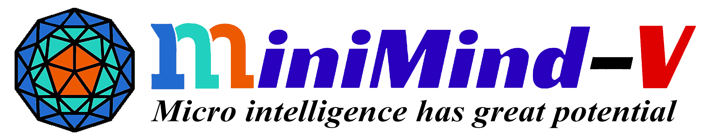

</div>


<div align="center">


[](https://github.com/jingyaogong/minimind-v/stargazers)
[](LICENSE)
[](https://github.com/jingyaogong/minimind-v/commits/master)
[](https://github.com/jingyaogong/minimind-v/pulls)
[](https://huggingface.co/collections/jingyaogong/minimind-v-67000833fb60b3a2e1f3597d)

</div>


<div align="center">
  <h3>"The Greatest Path is the Simplest"</h3>
</div>

<div align="center">

[中文](./README.md) | English

</div>


* This open-source project aims to train a small-parameter visual modal capable language model, **MiniMind-V**, from scratch within as fast as 3 hours.
* **MiniMind-V** is extremely lightweight, with the smallest version being about $\frac{1}{7000}$ the size of GPT-3, aiming to be quickly inferable and trainable even on personal GPUs.
* This is not only an implementation of an open-source model but also a tutorial for getting started with Visual Language Models (VLMs).
* We hope this project can provide researchers with a starting example, helping everyone to get up to speed and generate more exploration and innovation in the VLM field.

  > To avoid misunderstanding, "from scratch" specifically refers to further developing the pure language model MiniMind (which is a fully from-scratch trained GPT-like model) with visual capabilities.
  > For more details on the latter, please refer to the twin project [MiniMind](https://github.com/jingyaogong/minimind).

  > To avoid misunderstanding, "as fast as 3 hours" means you need to have a machine with a hardware configuration higher than mine. The detailed specifications will be provided below.


<div align="center">

The demo has been deployed to ModelScope's creative space, where you can experience it on this website:

[ModelScope Online Experience](https://modelscope.cn/studios/gongjy/minimind-v)

</div>

# 📌 Introduction

Visual Language Models (VLMs) like GPT-4V, Qwen-VL, LlaVA, etc., although impressive in performance, often require extremely high hardware configurations.
For personal devices, not only is the GPU memory far from sufficient to support training, but even inference can be very difficult.
We learn about the somewhat novel VLMs through reading papers or public account explanations, but often end up with a vague understanding.
What we really need to know is:
Is multimodal large models really as complex as imagined? What is their code implementation like?
Is the training process really that difficult? Can I start training from scratch with just one 2080Ti GPU?

Through **MiniMind-V**, this project hopes to answer these questions and help researchers understand the core principles of visual language models under limited hardware conditions.

> [!TIP]
> (As of 2024-10-04) The MiniMind-V series has completed pre-training of 2 model versions, requiring as little as 27M (0.027B) to have image recognition and dialogue capabilities!

| Model (Size)                   | Tokenizer Length | Inference Usage   | Release    | Subjective Rating (/100) |
| --------------------------- | ------------- | -------- | ------------ | ------------ |
| minimind-v-v1-small (27M)  | 6400         | 0.6 GB   | 2024.10.04  | 50'         |
| minimind-v-v1 (109M)       | 6400         | 1.1 GB   | 2024.10.04  | 60'         |

> This analysis was conducted on 2×RTX 3090 GPUs with Torch 2.1.2, CUDA 12.2, and Flash Attention 2.

### 👉**Recent Updates**

<details close> 
<summary> <b>2024-10-05 (newest 🎉)</b> </summary>

- MiniMind-V arrives as scheduled, first open-source release

</details>

# 📌 Environment

This is my personal software and hardware configuration; adjust as necessary:

```bash
CPU: Intel(R) Core(TM) i9-10980XE CPU @ 3.00GHz
Memory: 128 GB
GPU: NVIDIA GeForce RTX 3090(24GB) * 2
Environment: python 3.9 + Torch 2.1.2 + DDP single-machine multi-GPU training
```

* Ubuntu == 20.04
* Python == 3.9
* Pytorch == 2.1.2
* CUDA == 12.2
* [requirements.txt](./requirements.txt)

# 📌 Quick Start Test

* 0. Clone the project
    ```bash
    git clone https://github.com/jingyaogong/minimind-v & cd minimind-v
    ```

* 1. Install the environment
  ```bash
  pip install -r requirements.txt -i https://pypi.tuna.tsinghua.edu.cn/simple
  ```
  
* 2. Download the pre-trained model weights to the project root directory `minimind-v-v1`
    ```bash
    git clone https://huggingface.co/jingyaogong/minimind-v-v1
    ```

* 3. Download the pre-trained `clip-vit-base-patch32` model to the `model/clip_model` directory:
    ```bash
    cd model/clip_model & git clone https://hf-mirror.com/openai/clip-vit-base-patch32
    ```

* 4. Start the chat web server for testing conversations
    ```bash
    python web_server.py
    ```

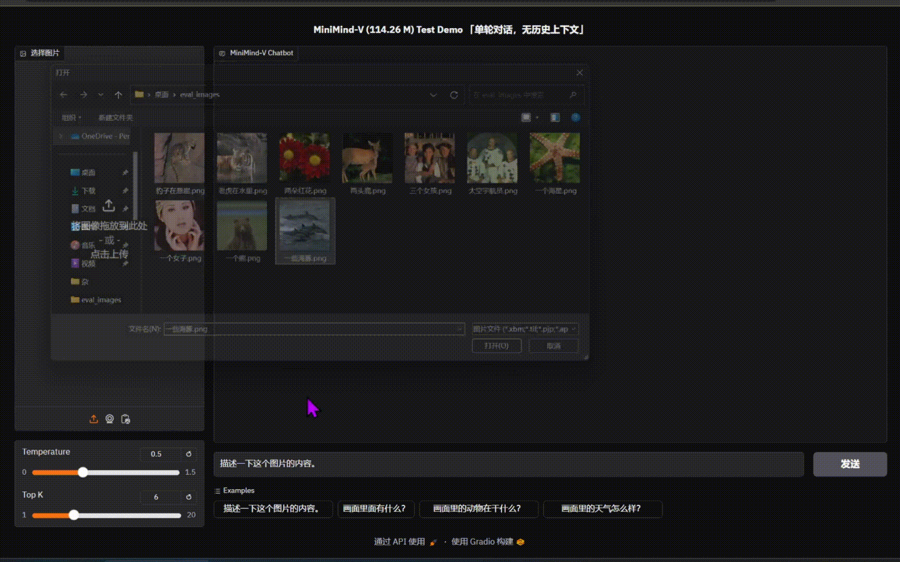

# 📌 Quick Start Train

* 0.Clone the project code
    ```text
    git clone https://github.com/jingyaogong/minimind-v
    ```

* 1.Environment setup
  ```bash
  pip install -r requirements.txt -i https://pypi.tuna.tsinghua.edu.cn/simple
  ```

* 2.Download the `clip-vit-base-patch32` model and place it in the `./model/clip_model` directory:
    ```bash
    cd ./model/clip_model & git clone https://hf-mirror.com/openai/clip-vit-base-patch32
    ```
  
* 3.If you want to train it yourself

    * 3.1 Download all contents of the dataset ([Baidu Netdisk](https://pan.baidu.com/s/1Nz36OBBvVBGEx-PwIb7ofg?pwd=6666) or [HuggingFace](https://hf-mirror.com/datasets/jingyaogong/minimind-v_dataset)) to the `./dataset` directory, and unzip `pretrain_images.zip` and `sft_images.zip`
    * 3.2 Adjust the model parameters in `./model/LMConfig.py`
      > Only need to adjust the dim and n_layers parameters, which are `(512+8)` or `(768+16)`, corresponding to `minimind-v-v1-small` and `minimind-v-v1`
    * 3.3 Download the [pre-trained weight file](https://pan.baidu.com/s/1LE1SPoPYGS7VNtT1tpf7DA?pwd=6666) of the MiniMind language model and place it in the `./out/` directory, named `*_llm.pth`
    * 3.4 Execute `python 1-pretrain_vlm.py` for pre-training, obtaining `*_vlm_pretrain.pth` as the output weights
    * 3.5 Execute `python 2-sft_vlm.py` for instruction fine-tuning, obtaining `*_vlm_sft.pth` as the output weights for fine-tuning

* 4.Test the inference effect of the self-trained model
    * Ensure that the used, completed training parameter weights `*.pth` files are located in the `./out/` directory
    * You can also directly download the [completed model weight files](https://pan.baidu.com/s/1LE1SPoPYGS7VNtT1tpf7DA?pwd=6666) and use the `*.pth` weight files I have trained
       ```text
      minimind-v/out
      ├── 512_llm.pth
      ├── 512_vlm_pretrain.pth
      ├── 512_vlm_sft.pth
      ├── 768_llm.pth
      ├── 768_vlm_pretrain.pth
      ├── 768_vlm_sft.pth
      ```
    * Use `python 3-eval_chat.py` to test the conversation effect of the model, where the test images are in `./dataset/eval_images`, and you can replace them as needed
      [eval_chat](images/3-eval_chat.png)

🍭 【Tip】Both pretraining and full-parameter instruction fine-tuning (pretrain and sft) support multi-GPU acceleration

* Single machine N-card training launch (DDP)
    ```bash
    torchrun --nproc_per_node N 1-pretrain_vlm.py
    # and
    torchrun --nproc_per_node N 2-sft_vlm.py
    ```

* Record the training process
    ```bash
    torchrun --nproc_per_node N 1-pretrain_vlm.py --use_wandb
    # and
    python 1-pretrain_vlm.py --use_wandb
    ```
  By adding the `--use_wandb` parameter, you can record the training process, and after the training is complete, you can view the training process on the wandb website. You can specify the project name and run name by modifying the `wandb_project` and `wandb_run_name` parameters.

# 📌 VLM Detail

The base language model MiniMind (LLM) for MiniMind-V (VLM) comes from the twin project [minimind](https://github.com/jingyaogong/minimind). For specific details on the model architecture, training specifics, principles, and test results, please refer to the [minimind](https://github.com/jingyaogong/minimind) project. To avoid redundancy, we will not discuss the LLM-related parts here, assuming you have a basic understanding of MiniMind (LLM).

> PS: Even if you do not wish to delve into the details of MiniMind (LLM), you can directly refer to Quick Test and Quick Start to quickly test or train MiniMind-V. This will not be significantly affected.

The structure of MiniMind-V remains almost unchanged, with only two additional sub-modules added: Visual Encoder and feature projection, as well as a multimodal fusion branch, to support input from multiple modalities:


At this point, it's interesting to ponder two questions: What is a **L**arge **L**anguage **M**odel (LLM)? And what is a multimodal model?

* [This article](https://www.jiqizhixin.com/articles/2024-09-15-3) perfectly articulates my thoughts, suggesting that the term LLM is quite inaccurate!

  > Although Large Language Models (LLMs) carry the word "language" in their name, they are actually not very related to language; this is merely a historical issue. A more accurate name would be autoregressive Transformer or something similar.
  LLMs are more of a general statistical modeling technique, primarily using autoregressive Transformers to simulate token streams, and these tokens can represent text, images, audio, action choices, or even molecules, among other things.
  Therefore, theoretically, any problem that can be framed as a process of simulating a series of discrete tokens can be addressed using LLMs.
  In fact, as the large language model technology stack matures, we may see an increasing number of problems being brought into this modeling paradigm. That is, the problem is fixed on using LLMs for 'predicting the next token', with the usage and meaning of tokens varying across different domains.

* [Professor Li Xi](https://person.zju.edu.cn/xilics#694283) similarly corroborates my view (the exact wording is not recalled, but the gist is as follows):

  > Text, video, speech, and actions, which appear to humans as "multimodal" signals, are essentially just a classification concept for information storage by humans.
  Just like `.txt` and `.png` files, although they differ in visual presentation and higher-level representation, there is no fundamental difference at their core.
  The notion of "multimodality" arises simply because of the human need to categorize these signals at different perceptual levels.
  However, for machines, regardless of the "modality" of the signal, they ultimately present as a string of binary "unimodal" digital sequences.
  Machines do not differentiate the modality source of these signals but rather process and analyze the information content carried by these sequences.

---

I personally believe that **G**enerative **P**retrained **T**ransformer (GPT) is a more fitting term than **L**arge **L**anguage **M**odel (LLM),
and thus I prefer to use "GPT" to represent LLM/VLM/GPT-like architectures, rather than to piggyback on OpenAI's popularity.

---

In summary, we can encapsulate what GPT does in one sentence:
GPT models predict the next, and the next, and the next token... until the model outputs an end token; here, the "token" does not necessarily have to be text!

---

* For LLM models, if understanding "images" is required, we can treat "images" as a special kind of "foreign language" never seen before, translating them through a "foreign dictionary" into a special language input for the LLM.
* For LLM models, if understanding "audio" is required, we can treat "audio" as a special kind of "foreign language" never seen before, translating them through a "foreign dictionary" into a special language input for the LLM.
* ...

---

<u>**So, to get MiniMind-V, we only need to accomplish two things:**</u>

1. Use a "foreign dictionary" proficient in translating images to translate the "foreign language" of images into the "LLM language" that the model can understand.
2. Fine-tune the LLM so that it goes through a period of adjustment with the "foreign dictionary," thereby better understanding images.

---

The "foreign dictionary" is generally referred to as the Visual Encoder model.
Similar to visual-language models such as LlaVA and Qwen-VL, MiniMind-V also selects open-source Clip series models as the Visual Encoder.
Specifically, it uses [clip-vit-base-patch32](https://huggingface.co/openai/clip-vit-base-patch32), a classic Visual Encoder based on the ViT-B/32 architecture, for describing image-text information.
The input image size is 224x224, and since the patches are 32×32, it generates 7*7+1(cls_token)=50 tokens as input to the encoder layer,
ultimately producing a 1×768 dimensional embedding vector for calculating error with text.
We do not need the final embedding representation, so we only take the output of the encoder layer, which is the output features of the VIT backbone.
In the code, this corresponds to the hook function in [./model/vision_utils.py](./model/vision_utils.py)'s get_img_embedding.
It retrieves the 50×768 dimensional features from the previous layer, which we then input as 50 visual tokens into MiniMind-V.
There are also larger Clip models like clip-vit-large-patch14, which have a stronger image understanding capability,
but a single image would generate 257 tokens, which, for a model of MiniMind's scale, would result in too long a context of image tokens, which is not conducive to training.

After obtaining the image encoder features, on one hand, it is necessary to align the 768-dimensional visual tokens with the text tokens of the LLM,
on the other hand, the image features must be mapped to the same space as the text embeddings, i.e., the text tokens and the native visual tokens need to be aligned and cannot be treated equally; this can be called cross-modal feature alignment.
[LlaVA-1](https://arxiv.org/pdf/2304.08485) accomplished this with a simple unbiased linear transformation, and the results were excellent; MiniMind-V does the same.


With this, the internal structural changes of MiniMind-V have been presented.

---

Next, we briefly discuss the changes in the external input and output of MiniMind-V.

The input for VLM is still a piece of text, which includes a special <image> placeholder.
After computing the text embedding, the vector generated by the image encoder can be projected into the part of the embedding corresponding to the placeholder, replacing the original placeholder embedding.
For example:

```text
<image>\nWhat is the content of this image?
```

minimind-v uses a 50-character `<<<...>>>` placeholder to replace the image,
the reason for 50 characters was mentioned earlier:
any image is encoded by the clip model into 50×768 dimensional tokens.
Therefore, the prompt for minimind-v:

```text
<<<<<<<<<<<<<<<<<<<<<<<<<>>>>>>>>>>>>>>>>>>>>>>>>>\nWhat is the description of this picture?
```

After computing the embedding and projection, and replacing the image part tokens, 
the entire computation process to output is no different from the LLM part.


<u>With this, all the details of MiniMind-V have been presented.</u>

<u>The implementation of MiniMind-V did not reference any third-party code; it is based on MiniMind with minimal modifications, hence the code implementation is significantly different from models like LlaVA.
The core changes between MiniMind-V and MiniMind do not exceed 100 lines, making it easy to get started.</u>

# 📌 Experiment

## Dataset

Source: [Chinese-LLaVA-Vision](https://huggingface.co/datasets/LinkSoul/Chinese-LLaVA-Vision-Instructions)
Contains approximately 600,000 pre-training images and <100,000 instruction fine-tuning images, derived from CC-3M and COCO 2014, with translated Q&A content for better support of the Chinese language. The dataset has been further resized, organized, and compressed.

Pre-training dataset format:

```json
{
  "id": "GCC_train_000644518",
  "image": "GCC_train_000644518.jpg",
  "conversations": [
    {
      "from": "human",
      "value": "Write a brief but informative image summary.\n<image>"
    },
    {
      "from": "gpt",
      "value": "Adding saltwater to a metal pot with a black background, in slow motion fps"
    }
  ]
}
```

Instruction fine-tuning dataset format:

```json
{
  "id": "000000334872",
  "image": "000000334872.jpg",
  "conversations": [
    {
      "from": "human",
      "value": "<image>\nAre people in the photo going downhill skiing or cross-country skiing?"
    },
    {
      "from": "gpt",
      "value": "People in the photo are cross-country skiing in the forest because they are on a trail rather than on a steep slope."
    }
  ]
}
```

Note: For instruction fine-tuning, only one round of conversation is retained, training a single-turn dialogue model, to prevent the performance of small models from being dragged down by long text.

Final dataset download link: [Baidu Netdisk](https://pan.baidu.com/s/1Nz36OBBvVBGEx-PwIb7ofg?pwd=6666) | [HuggingFace](https://huggingface.co/datasets/jingyaogong/minimind-v_dataset)

## Training

The pre-training learns general knowledge about images, such as what a deer or dog is, from 595K datasets.

The instruction fine-tuning learns the real Q&A format for asking questions about images from 230K real dialogue datasets.

`1-pretrain_vlm.py` executes pre-training, yielding `*_vlm_pretrain.pth` as the output weights of pre-training.

`2-sft_vlm.py` performs instruction fine-tuning, resulting in `*_vlm_sft.pth` as the output weights of instruction fine-tuning.

During training, the visual encoder, which is the CLIP model, is frozen, and only the Projection and LLM parts are fine-tuned.

> Pretrain 512+8 Model (Training Time and Loss Reference Chart)
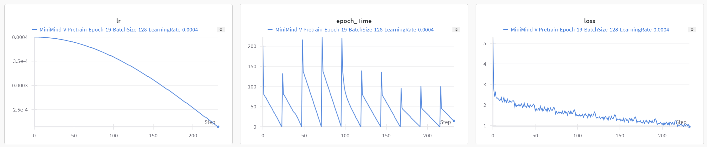
> Pretrain 768+16 Model (Training Time and Loss Reference Chart)
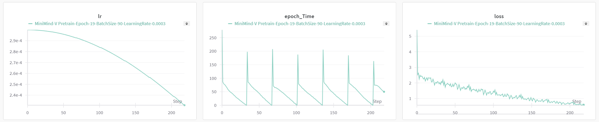
> SFT 512+8 Model (Training Time and Loss Reference Chart)
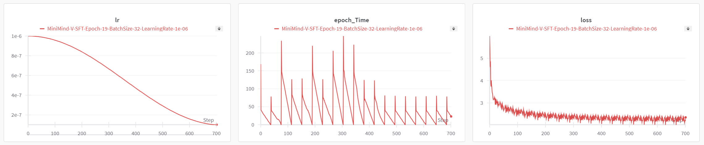
> SFT 768+16 Model (Training Time and Loss Reference Chart)
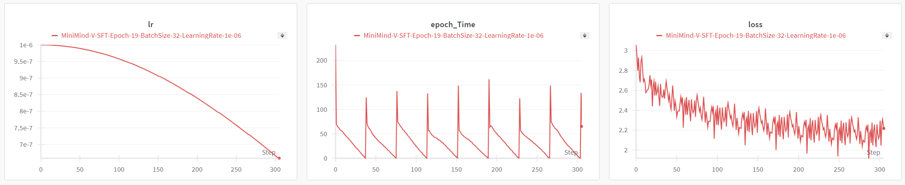

## Trained Model Weights

(`.pth` weight files) Download link: [Baidu Netdisk](https://pan.baidu.com/s/1a7_C7HdCMfnG2Dia3q85FQ?pwd=6666)

(`transformers` model files)
Download link: [HuggingFace](https://huggingface.co/collections/jingyaogong/minimind-v-67000833fb60b3a2e1f3597d)

> Note: HuggingFace versions are all post-instruction fine-tuned MiniMind-V models

| Model Name             | params | Config                      | file_name                                           |
|------------------------|--------|-----------------------------|-----------------------------------------------------|
| minimind-v-v1-small    | 27M    | d_model=512<br/>n_layers=8  | Pre-trained: 512_vllm_pretrain.pth<br/>Fine-tuned: 512_vllm_sft.pth |
| minimind-v-v1          | 109M   | d_model=768<br/>n_layers=16 | Pre-trained: 768_vllm_pretrain.pth<br/>Fine-tuned: 768_vllm_sft.pth |

# 📌 Test

### Effectiveness Testing

<table>
  <thead>
    <tr>
      <th>Image</th>
      <th>512_pretrain</th>
      <th>512_sft</th>
      <th>768_pretrain</th>
      <th>768_sft</th>
    </tr>
  </thead>
  <tbody>
    <tr>
      <td>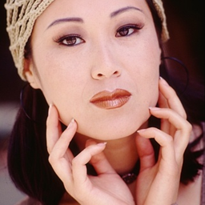</td>
      <td>Hair and makeup, I like her natural hair!</td>
      <td>This picture depicts a young woman, she is wearing a suit, and a tie, which indicates that she may be attending a special fashion event or celebration.</td>
      <td>A human-made actor's adventure movie.</td>
      <td>This picture portrays a portrait of a woman, who is wearing a pink dress.</td>
    </tr>
    <tr>
      <td>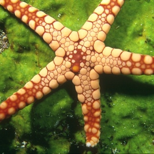</td>
      <td>Fossils in water, a still line composed of a ring of fossil clusters.</td>
      <td>The picture shows a large octopus, a potential marine creature, it is either on the surface of the water or in the ocean.</td>
      <td>Starfish and tentacles.</td>
      <td>The picture shows a starfish on the beach, including the starfish, and an underwater object.</td>
    </tr>
    <tr>
      <td>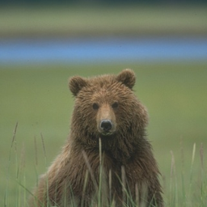</td>
      <td>In the wild, in the valley.</td>
      <td>The picture features plants and a grizzly bear sitting on the grass.</td>
      <td>A close-up of a grizzly bear</td>
      <td>The picture shows a grizzly bear standing in an open field of grass, surrounded by trees and bushes, with a backpack placed on top of it.</td>
    </tr>
    <tr>
      <td>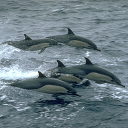</td>
      <td>A group of tourists watched this movie.</td>
      <td>This picture depicts a flock of seagulls flying over the water, on the water. The presence of seagulls suggests that they are looking for food. Seagulls nest on the water, possibly to protect themselves from potential dangers, such as sharp teeth and reptiles of seagulls.</td>
      <td>A group of dolphins or sheep fishing by boat during a day's voyage</td>
      <td>This picture shows a group of people swimming among a large group of dolphins and dolphins nearby.</td>
    </tr>
    <tr>
      <td>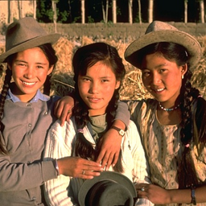</td>
      <td>A girl and her friends are sitting on a bench, wearing long white robes.</td>
      <td>This scene depicts a vibrant young girl, they are dressed in black and white attire, standing in the middle of a crowd, all of whom are also dressed in black and white, indicating their outfits are lively and elegant. In the scene, there are two girls in the background, a woman behind, and another woman standing, all wearing black clothes. This suggests they are enjoying their outfits and attire, possibly attending a special festival or celebration.</td>
      <td>The girls are on the city streets.</td>
      <td>This picture portrays a man and a woman in traditional clothing, standing next to them, they are spending family time together. Throughout the scene, you can see a little boy and a girl, both wearing cowboy hats, which suggests they are participating in a family gathering, which could be a party or celebration, or they might be discussing an interesting activity or event.</td>
    </tr>
    <tr>
      <td></td>
      <td>This photo contains several deer.</td>
      <td>This picture captures a white-tailed deer, sitting on the grass, using its photo to capture a red deer.</td>
      <td>The animal looks as if it is about to hide behind a tree, he looks majestic, as he cannot control himself.</td>
      <td>This picture depicts a doe and a deer, the doe is standing in the woods, a sheep, and a deer.</td>
    </tr>
    <tr>
      <td></td>
      <td>The bouquet's flowers have barely bloomed.</td>
      <td>The picture shows red and yellow flowers, which are called "vase".</td>
      <td>The flower heads are close together.</td>
      <td>The picture shows red flowers, surrounded by several roses.</td>
    </tr>
    <tr>
      <td>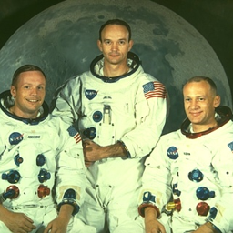</td>
      <td>An astronaut posing with Earth during a space mission.</td>
      <td>This image depicts a dynamic moon, walking on the moon.</td>
      <td>An astronaut resting in a cradle during a mission, with his team in the background.</td>
      <td>This picture portrays an astronaut in the image of a space station.</td>
    </tr>
    <tr>
      <td>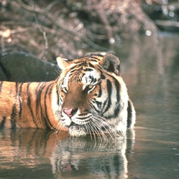</td>
      <td>A tiger in the water looking at the camera.</td>
      <td>The picture shows a large brown seal swimming in the water, resting in the water.</td>
      <td>A tiger caged in a zoo</td>
      <td>The picture shows a small bear, lying on a branch of a tree.</td>
    </tr>
    <tr>
      <td></td>
      <td>This is an endangered species.</td>
      <td>In the picture, a black and white cat is walking on the rocks.</td>
      <td>A leopard in the wild on the rocks outside a cave, at sunrise</td>
      <td>This picture shows a red panda walking on the rocks.</td>
    </tr>
  </tbody>
</table>

### Start Inference

```bash
python web_server.py
```

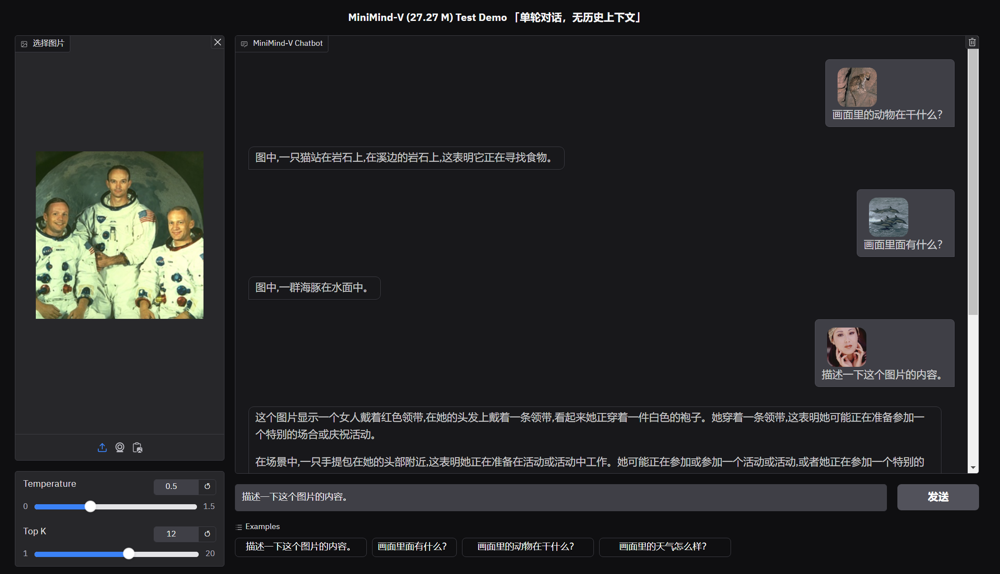


### Summary of Effects

---
Based on the provided table data, the performance of the four models can be summarized as follows:

1. **512_pretrain**:
    - **Brief and inaccurate descriptions**: Most descriptions fail to clearly convey the image content, often providing unrelated narratives. For example, the starfish image is described as "fossils in water," which is far off the mark.
    - **Lack of detail**: In most cases, only simple, vague descriptions are given, failing to delve into the details or context of the image. For instance, for the tiger image, it simply says "looking at the camera in the water."

2. **512_sft**:
    - **More specific descriptions**: Compared to 512_pretrain, 512_sft provides more detailed explanations and attempts to capture specific elements of the scene. For example, when describing the woman image, it mentions "suit" and "tie," giving a clearer depiction.
    - **Occasional errors or redundancy**: Some descriptions are overly complex or even irrelevant to the image, such as mentioning seagulls, nesting, etc., in the dolphin image, which are not related.

3. **768_pretrain**:
    - **Incoherent information**: The performance of this model is quite scattered, with descriptions often being vague and incomplete. For example, in describing the woman image, it only mentions "a human-made actor's adventure movie," without clearly explaining the image content.
    - **Partially accurate but with less overall information**: Some descriptions, although relevant to the image, are very brief. For example, the starfish description only states "starfish and tentacles," lacking a full sense of the scene.

4. **768_sft**:
    - **Comprehensive and specific descriptions**: This model's descriptions are the most detailed and precise among the four. For instance, when describing the bear image, it mentions "standing in an open field of grass, surrounded by trees and bushes, with a backpack," capturing multiple elements of the image.
    - **Stronger comprehension ability**: This model can identify the scene and context of the image, providing reasonable interpretations and speculations. For example, describing a "family gathering" or "celebration" gives the image a more contextual connection.

### GPT=4o Summary:

- **512_pretrain** performs the worst, with simple and inaccurate descriptions.
- **512_sft** has improved detail in descriptions but occasionally includes irrelevant information.
- **768_pretrain** has poor coherence in information, yet provides basic descriptions in some aspects.
- **768_sft** performs the best, offering detailed, accurate descriptions, and is able to make good context-based inferences.

### Personal Summary:

- Visual signals are a special kind of foreign language for LLMs, so the ability to "learn foreign languages" largely depends on the capabilities of the LLM.
- The stronger the performance of the LLM, the stronger the corresponding VLM will be, and the performance gain will be significant.
- Areas for improvement:
  - Simpler projection methods for cross-modal feature alignment result in greater performance loss compared to Cross-Attention.
  - Larger and more powerful large-series Clip models can be tried, using more fine-grained token representations for image features, which are currently very rough.
  - The resolution is not high, theoretically only 224×224 (minimind-v dataset is set to 128×128 to save space).
  - ...

---

# 📌 Acknowledge

> [!TIP]
> If you find `MiniMind-V` helpful, please add a ⭐ on GitHub<br/>
> Due to the length and limited proficiency, there may be oversights; feel free to discuss corrections or submit PRs to improve the project on Issues<br/>
> Your support is the driving force for continuous improvement of the project

## 🤝 [Contributors](https://github.com/jingyaogong/minimind/graphs/contributors)

<a href="https://github.com/jingyaogong"></a>
&nbsp;

## 😊 Acknowledgments

<details close> 
<summary> <b>Reference Links & Thanks to the following excellent papers or projects</b> </summary>

- No particular order
- [LlaVA](https://arxiv.org/pdf/2304.08485)
- [LlaVA-VL](https://arxiv.org/pdf/2310.03744)
- [Chinese-LLaVA-Vision-Instructions](https://huggingface.co/datasets/LinkSoul/Chinese-LLaVA-Vision-Instructions)

</details>


## 🫶Supporter

<a href="https://github.com/jingyaogong/minimind-v/stargazers">
    <picture>
      <source media="(prefers-color-scheme: dark)" srcset="https://reporoster.com/stars/dark/jingyaogong/minimind-v"/>
      <source media="(prefers-color-scheme: light)" srcset="https://reporoster.com/stars/jingyaogong/minimind-v"/>
      
    </picture>
</a>

<a href="https://github.com/jingyaogong/minimind-v/network/members">
    <picture>
      <source media="(prefers-color-scheme: dark)" srcset="https://reporoster.com/forks/dark/jingyaogong/minimind-v"/>
      <source media="(prefers-color-scheme: light)" srcset="https://reporoster.com/forks/jingyaogong/minimind-v"/>
      
    </picture>
</a>

<picture>
  <source media="(prefers-color-scheme: dark)" srcset="https://api.star-history.com/svg?repos=jingyaogong/minimind-v&type=Date&theme=dark"/>
  <source media="(prefers-color-scheme: light)" srcset="https://api.star-history.com/svg?repos=jingyaogong/minimind-v&type=Date"/>
  
</picture>


# License

This repository is licensed under the [Apache-2.0 License](LICENSE).

