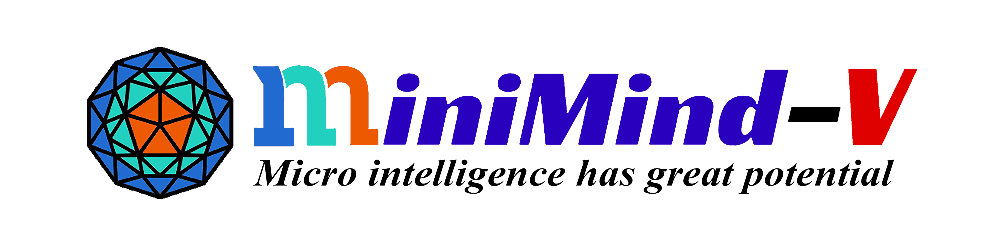
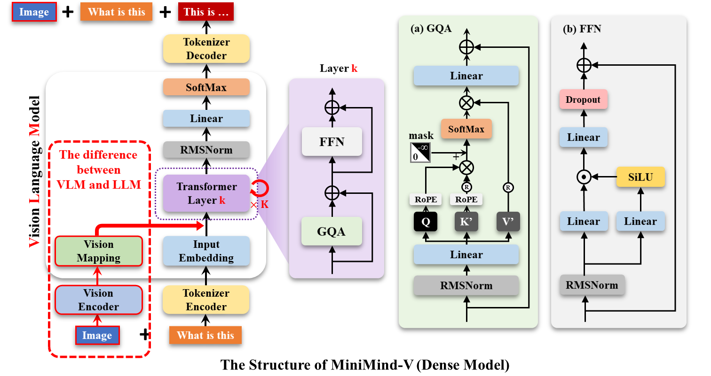
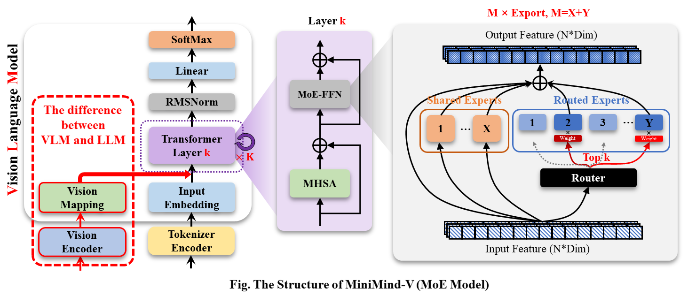
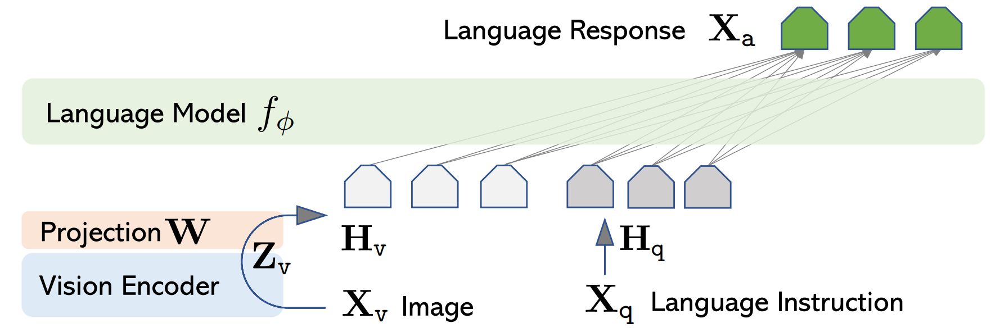
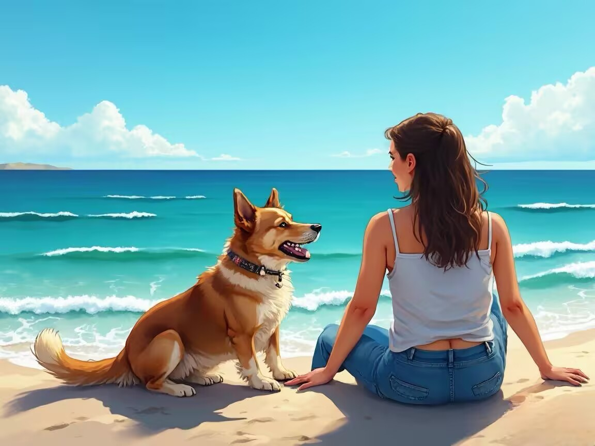
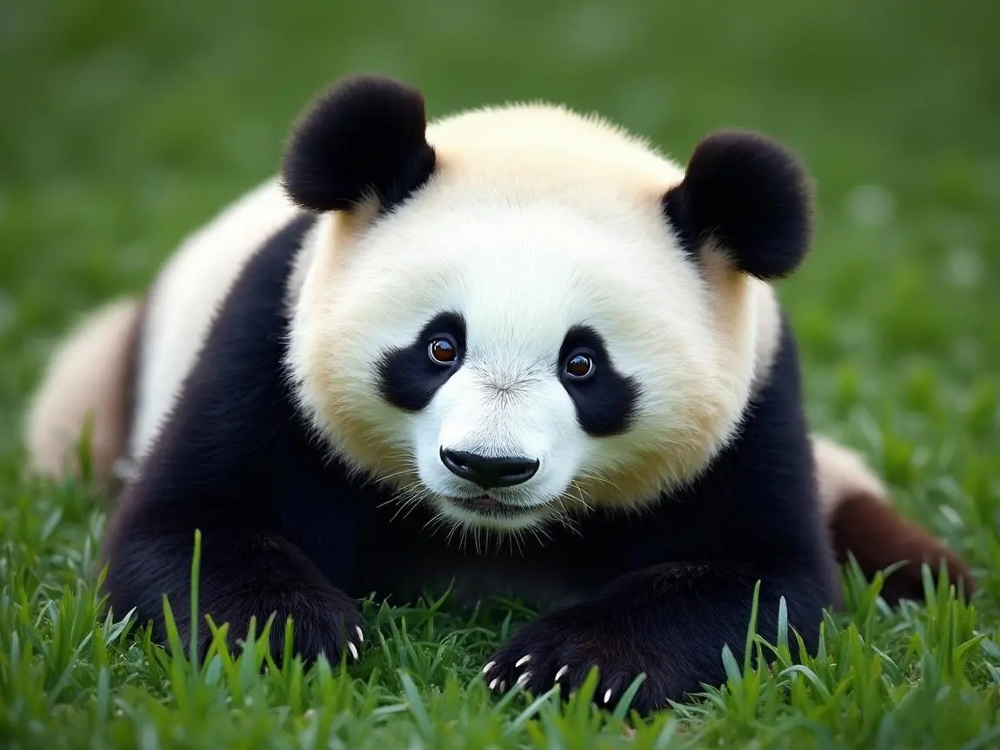
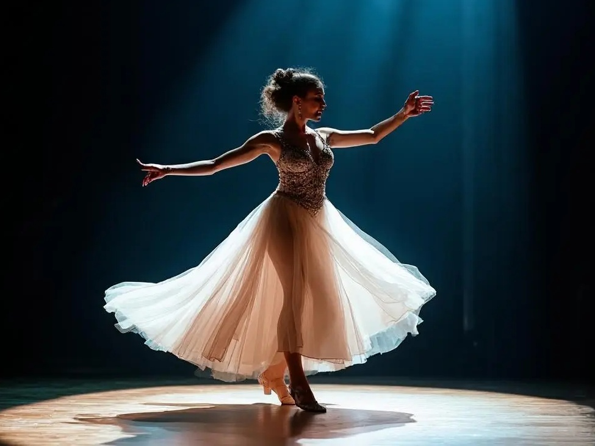
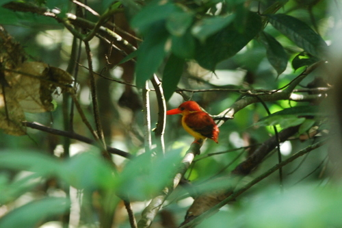

<div align="center">



</div>


<div align="center">


[](https://github.com/jingyaogong/minimind-v/stargazers)
[](LICENSE)
[](https://github.com/jingyaogong/minimind-v/commits/master)
[](https://github.com/jingyaogong/minimind-v/pulls)
[](https://huggingface.co/collections/jingyaogong/minimind-v-67000833fb60b3a2e1f3597d)

</div>


<div align="center">
  <h3>"The Greatest Path is the Simplest"</h3>
</div>

<div align="center">

[中文](./README.md) | English

</div>

* This project aims to train a super-small multimodal vision-language model, **MiniMind-V**, with just a cost of 1.3 RMB
  and 1 hours of work, starting from scratch!
* The smallest version of **MiniMind-V** is only about $\frac{1}{7000}$ the size of GPT-3, designed to enable fast
  inference and even training on personal GPUs.
* **MiniMind-V** is an extension of the visual capabilities of the [MiniMind](https://github.com/jingyaogong/minimind)
  pure language model.
* The project includes full code for the minimalist structure of large VLM models, dataset cleaning, pretraining, and
  supervised fine-tuning (SFT).
* This is not only the smallest implementation of an open-source VLM model but also a concise tutorial for beginners in
  vision-language models.
* The hope is that this project can provide a useful example to inspire others and share the joy of creation, helping to
  drive progress in the wider AI community!

> To avoid misunderstandings, the "1 hours" is based on testing (`1 epoch`) with an NVIDIA 3090 hardware device (single GPU), and
> the "1.3 RMB" refers to GPU server rental costs. 

<div align="center">


[🔗🤖 Online Experience](https://www.modelscope.cn/studios/gongjy/MiniMind-V) | [🔗🎞️ Video Introduction](https://www.bilibili.com/video/BV1Sh1vYBEzY)

</div>

# 📌 Introduction

“Building a plane with Legos is much more exciting than flying in first class!”
Is it really as complex as imagined to build a VLM-based multimodal large model? How is the code implementation done?
Is the training process difficult? Now, let's explore the answers and feel the joy of creation together!

> [!TIP]
> (As of 2025-02-20) The MiniMind-V series has completed the training of the following model versions, with the smallest
> requiring only 26M (0.026B) parameters, capable of both image recognition and conversation!

| Model (Size)              | Inference Memory | Release    |
|---------------------------|------------------|------------|
| MiniMind2-V (104M)        | 0.6 GB           | 2025.02.20 |
| MiniMind2-Small-V (26M)   | 1.1 GB           | 2025.02.20 |
| minimind-v-v1-small (27M) | 0.6 GB           | 2024.10.04 |
| minimind-v-v1 (109M)      | 1.1 GB           | 2024.10.04 |

### 👉**Recent Updates**

<details close> 
<summary> <b>2025-02-20 (newest 🎉)</b> </summary>

- MiniMind2-V updated alongside MiniMind2
- Significant reduction of all redundant code, standardized code format
- Major simplification of the model's redundant structure
- Updated dataset format, expanded with new SFT datasets
- Better performance than the previous VLM version!

</details>

<details close> 
<summary> <b>2024-10-05</b> </summary>

- MiniMind-V released on schedule, first open-source release

</details>

# 📌 Quick Start

<details style="color:rgb(128,128,128)">
<summary>Sharing my hardware and software configuration (for reference only)</summary>

* CPU: Intel(R) Core(TM) i9-10980XE CPU @ 3.00GHz
* RAM: 128 GB
* GPU: NVIDIA GeForce RTX 3090(24GB) * 8
* Ubuntu==20.04
* CUDA==12.2
* Python==3.10.16
* [requirements.txt](./requirements.txt)

</details>

### Step 0

```bash
# Clone the code repository
git clone https://github.com/jingyaogong/minimind-v
```

```bash
# Download the clip model to the ./model/vision_model directory
git clone https://huggingface.co/openai/clip-vit-base-patch16
# or
git clone https://www.modelscope.cn/models/openai-mirror/clip-vit-base-patch16
```

```bash
# Download the pure language model to the ./out directory (as the base language model for training VLM):
https://huggingface.co/jingyaogong/MiniMind2-V-PyTorch/blob/main/lm_512.pth
# or
https://huggingface.co/jingyaogong/MiniMind2-V-PyTorch/blob/main/lm_768.pth
```


## Ⅰ Test an existing model's performance

### 1. Environment Preparation

```bash
pip install -r requirements.txt -i https://pypi.tuna.tsinghua.edu.cn/simple
```

### 2. Download the model

```bash
git clone https://huggingface.co/jingyaogong/MiniMind2-V
```

### 3. Command-line Q&A

```bash
# load=0: load from pytorch model, load=1: load from transformers-hf model
python eval_vlm.py --load 1
```

### 4. Or start the WebUI

```bash
python web_demo_vlm.py
```

## Ⅱ Train from scratch

### 1. Environment Preparation

```bash
pip install -r requirements.txt -i https://pypi.tuna.tsinghua.edu.cn/simple
```

<details style="color:rgb(128,128,128)">
<summary>Note: Test if Torch can use CUDA</summary>

```bash
import torch
print(torch.cuda.is_available())
```

If unavailable, download the whl file from [torch_stable](https://download.pytorch.org/whl/torch_stable.html) for
installation. Refer
to [this link](https://blog.csdn.net/weixin_45456738/article/details/141029610?ops_request_misc=&request_id=&biz_id=102&utm_term=%E5%AE%89%E8%A3%85torch&utm_medium=distribute.pc_search_result.none-task-blog-2~all~sobaiduweb~default-2-141029610.nonecase&spm=1018.2226.3001.4187)
for help.

</details>

### 2. Download Data

Download the required dataset files from
the [dataset download link](https://huggingface.co/datasets/jingyaogong/minimind-v_dataset), create a `./dataset`
directory, and place the files under `./dataset`.

`*.jsonl` is the Q&A dataset, and `*images` are the accompanying image data. After downloading, decompress the image
data.

<details style="color:rgb(128,128,128)">
<summary>Note: Dataset Details</summary>

Please reserve about 5GB of space for the dataset. If there is insufficient space for pretrain data, you can try
skipping the pretrain training step and proceed directly to SFT training.

</details>

### 3. Start Training

**3.1 Pretraining (Learning image description)**

```bash
python train_pretrain_vlm.py --epochs 4
```

> Run pretraining to get `pretrain_vlm_*.pth` as the pretrained model's output weights (* represents the model
> dimension, default is 512).

**3.2 Supervised Fine-Tuning (Learning image-caption dialogue style)**

```bash
python train_sft_vlm.py --epochs 4
```

> Perform supervised fine-tuning to get `sft_vlm_*.pth` as the output weights for the fine-tuned model.

<details style="color:rgb(128,128,128)">
<summary>Note: Training Details</summary>

By default, the training process saves model parameters every 100 steps to the `./out/***.pth` file (it will overwrite
previous weight files).

</details>

---

### 4. Test the Model's Performance

Ensure that the model `*.pth` file you want to test is located in the `./out/` directory.
You can also directly download the pre-trained `*.pth` file
from [here](https://huggingface.co/jingyaogong/MiniMind2-V-PyTorch).

```bash
python eval_vlm.py --model_mode 1 # Default is 0: test pretrain model, set to 1: test sft model
```

---

> [!TIP]
> The training scripts are based on PyTorch's native framework and support multi-card acceleration. If your device has
> N (N>1) GPUs:

Single-machine N-card training method (DDP, supports multi-machine multi-card cluster)

```bash
torchrun --nproc_per_node N train_xxx.py
```

<details style="color:rgb(128,128,128)">
<summary>Note: Other Details</summary>

Single-machine N-card training (DeepSpeed)

```bash
deepspeed --master_port 29500 --num_gpus=N train_xxx.py
```

You can enable wandb logging during training:

```bash
# You need to log in: wandb login
torchrun --nproc_per_node N train_xxx.py --use_wandb
# and
python train_xxx.py --use_wandb
```

By adding the `--use_wandb` parameter, you can log the training process, and after training is complete, you can view
the process on the wandb website. You can specify the project name and run name by modifying the `wandb_project`
and `wandb_run_name` parameters.

</details>

# 📌 VLM Detail

The base language model of MiniMind-V (VLM), MiniMind (LLM), comes from the twin
project [minimind](https://github.com/jingyaogong/minimind). For detailed information on the model structure, training
specifics, principles, and testing results, please refer to the [minimind](https://github.com/jingyaogong/minimind)
project. To reduce redundancy, the discussion on LLM-related topics is omitted here, assuming you have a basic
understanding of MiniMind (LLM).

> Even if you are not very familiar with the details of LLMs, you can still follow the "Quick Start" guide to train a
> MiniMind-V, as it remains unaffected and the repository focuses on the lowest cost for out-of-the-box use!

MiniMind-V's structure adds two submodules, a Visual Encoder and a feature projection, with a modality-mixing branch to
support inputs from multiple modalities:




<details>
<summary> [Important] Some Interesting Thoughts </summary>

Let's take a moment to think about two questions:

* What is a **Large Language Model (LLM)**?
* What is a multimodal model?

[This article](https://www.jiqizhixin.com/articles/2024-09-15-3) perfectly aligns with my thoughts:  
Although the name "large language model" (LLM) contains the word "language," they are actually not closely related to
language; this is just a historical issue. A more accurate name would be self-regressive Transformer or something else.
LLMs are more of a general statistical modeling technology, mainly using a self-regressive Transformer to simulate token
flows. These tokens can represent text, images, audio, action choices, and even molecules—anything, really.  
Therefore, as long as the problem can be converted into a process of simulating a series of discrete tokens, LLM can
theoretically solve it. In fact, with the increasing maturity of large language model technologies, we may see more and
more problems falling under this modeling paradigm. In other words, the problem is fixed in using LLM to "predict the
next token," but the role and meaning of the tokens differ in each domain.

[ZJU-LiXi](https://person.zju.edu.cn/xilics#694283) has also mentioned a similar viewpoint (roughly stated below):  
Text, video, audio, actions, etc., are considered "multimodal" signals in human perception, but the term "modality" is
essentially just a classification concept based on how humans store information. Just like `.txt` and `.png` files,
though they differ in visual presentation and higher-level forms, they are fundamentally the same. The concept of "
multimodal" arose simply because humans need to categorize these signals based on different sensory dimensions.  
However, for machines, regardless of the signal's "modality," they are ultimately presented as a sequence of binary "
monomodal" numbers. Machines do not differentiate the origin of these signals; they just process and analyze the
information contained within these sequences.

Personally, I think **Generative Pretrained Transformer (GPT)** is a more fitting term than **Large Language Model (LLM)
**, and I prefer to use "GPT" to represent models in the LLM/VLM/GPT-like architecture series rather than to ride on
OpenAI's coattails.

To summarize what GPTs do in one sentence:

A GPT model predicts the next, next-next, next-next-next token, etc., based on the current token... until the model
outputs the end token; here, the "token" doesn’t necessarily have to be text!

```text
> For an LLM model, if we need to understand an "image," we just treat the "image" as a special "foreign language" that has never been encountered before, and translate it into the "LLM language" via a "foreign language dictionary."
> For an LLM model, if we need to understand "audio," we just treat "audio" as a special "foreign language" that has never been encountered before, and translate it into the "LLM language" via a "foreign language dictionary."
> ...
```

<u>**To obtain MiniMind-V, we only need to do these 2 things:**</u>

1. Use the **"foreign language dictionary"** that is good at translating images, to translate the image from the **"
   foreign language"** into a model-understandable **"LLM language."**
2. Fine-tune the LLM so that it and the **"foreign language dictionary"** go through a period of adaptation, thereby
   better understanding images.

The "foreign language dictionary" is referred to as the Visual Encoder model.  
Like LlaVA, Qwen-VL, and other visual language models, MiniMind-V also uses the open-source Clip series models as the
Visual Encoder.  
Specifically, we use [clip-vit-base-patch16](https://huggingface.co/openai/clip-vit-base-patch16), a classic Visual
Encoder based on the ViT-B/16 architecture for describing image-text information.  
The input image size is 224x224, and because the Patch size is 16×16, it generates 14*14=196 tokens as the input to the
encoder layer, which produces a 1×768 dimensional embedding vector for calculating error with the text.  
We don’t need the final embedding representation, so we only take the output from the encoder layer, which is the output
feature from the core ViT backbone.  
It receives the feature of size 196×768 from the previous layer, which we use as 196 visual tokens to input into
MiniMind-V.  
After obtaining the image encoder features, the integration with the LLM requires aligning the 768-dimensional visual
tokens with the LLM's text tokens, and mapping the image features into the same space as text embeddings. In other
words, the image features and native visual tokens cannot be directly treated the same; they require cross-modal feature
alignment.  
[LlaVA-1](https://arxiv.org/pdf/2304.08485) uses a simple unbiased linear transformation to achieve this, with great
success, and MiniMind-V does the same.



With that, the internal structural changes of MiniMind-V are now fully presented.

</details>


---

Next, let's briefly discuss the changes in the external input and output of MiniMind-V.

The input to the VLM is still a segment of text containing special <image> placeholders.  
After computing the text embedding, the vector generated by the image encoder can be projected onto the corresponding
embedding part of the placeholder, replacing the original placeholder embedding.  
For example:

```text
<image>\nWhat is in this image?
```

In `minimind-v`, the image is replaced by a 196-character `@@@...@@@` placeholder. The reason for using 196 characters
is explained earlier:  
Any image is encoded by the Clip model as 196×768-dimensional tokens,  
thus the `minimind-v` prompt becomes:

```text
@@@......@@@\nWhat is this image describing?
```

After calculating the embedding and projection, and replacing the image token part, the entire calculation process to
output is no different from that of the LLM part.


For handling multiple images at once, this can be achieved by injecting multiple `<image>` placeholders without needing
to modify the framework at all.

<details>
<summary> Expansion Ideas for Video Understanding </summary>

written by [@xinyanghuang7](https://github.com/xinyanghuang7)

For the video understanding capabilities of multimodal large models, one feasible approach is to refer to the existing
MiniCPM-V 2.6 Python example for video understanding.
The main idea is to extract key frames from the video and then perform multi-image inference.
Therefore, if you want to add video understanding capabilities to MiniMind-V, you can base it on the existing
multi-image training, refer to the key frame extraction method in this Python script, and increase the number of images
supported in the training files.
The more MAX_NUM_FRAMES supported, the more GPU memory it will consume.

```text
import torch
from PIL import Image
from transformers import AutoModel, AutoTokenizer
from decord import VideoReader, cpu  # pip install decord

model = AutoModel.from_pretrained('openbmb/MiniCPM-V-2_6', trust_remote_code=True,
                                  attn_implementation='sdpa',
                                  torch_dtype=torch.bfloat16)  # sdpa or flash_attention_2, no eager
model = model.eval().cuda()
tokenizer = AutoTokenizer.from_pretrained('openbmb/MiniCPM-V-2_6', trust_remote_code=True)

MAX_NUM_FRAMES = 64  # if cuda OOM set a smaller number


def encode_video(video_path):
    def uniform_sample(l, n):
        gap = len(l) / n
        idxs = [int(i * gap + gap / 2) for i in range(n)]
        return [l[i] for i in idxs]

    vr = VideoReader(video_path, ctx=cpu(0))
    sample_fps = round(vr.get_avg_fps() / 1)  # FPS
    frame_idx = [i for i in range(0, len(vr), sample_fps)]
    if len(frame_idx) > MAX_NUM_FRAMES:
        frame_idx = uniform_sample(frame_idx, MAX_NUM_FRAMES)
    frames = vr.get_batch(frame_idx).asnumpy()
    frames = [Image.fromarray(v.astype('uint8')) for v in frames]
    print('num frames:', len(frames))
    return frames


video_path = "video_test.mp4"
frames = encode_video(video_path)
question = "Describe the video"
msgs = [
    {'role': 'user', 'content': frames + [question]},
]

# Set decode params for video
params = {}
params["use_image_id"] = False
params["max_slice_nums"] = 2  # If cuda OOM and video resolution is greater than 448*448, set to 1

answer = model.chat(
    image=None,
    msgs=msgs,
    tokenizer=tokenizer,
    **params
)
print(answer)
```

</details>

At this point, all the details of `MiniMind-V` have been presented.
The `MiniMind-V` model subclass completely inherits from `MiniMind`,
and is generated with **minimal** changes based on the latter,
with core algorithm modifications `< 50 lines`, making the migration difficulty very low.
Therefore, there may be differences with models like `LlAVA`, but the overall idea remains consistent.

# 📌 Experiment

## Ⅰ Dataset

Source: [Chinese-LLaVA-Vision](https://huggingface.co/datasets/LinkSoul/Chinese-LLaVA-Vision-Instructions)  
Contains approximately 570,000 pre-trained images from CC-3M and COCO 2014;  
[llava-en-zh-300k](https://huggingface.co/datasets/BUAADreamer/llava-en-zh-300k)  
Contains 300k instruction fine-tuning data and 150k images.  
The Q&A content has been translated, with better support for Chinese, further organized and resized.

(pretrain_vlm_data.jsonl) Pre-training dataset format:

```json lines
{
  "conversations": [
    {
      "role": "user",
      "content": "Provide a brief description of the given image.\n<image>"
    },
    {
      "role": "assistant",
      "content": "Olive oil is a healthy ingredient for free use."
    }
  ],
  "image": "GCC_train_002582585.jpg"
}
```

(sft_vlm_data.jsonl) Single image instruction fine-tuning dataset format:

```json lines
{
  "conversations": [
    {
      "role": "user",
      "content": "What impact does the location of the alarm clock have on sleep quality?<image>"
    },
    {
      "role": "assistant",
      "content": "Place the digital alarm clock on the nightstand..."
    }
  ],
  "image": "train-00000-of-00001_image_0_0.jpg"
}
```

(sft_vlm_data_multi.jsonl) Multi-image instruction fine-tuning dataset format:

```json lines
{
  "conversations": [
    {
      "role": "user",
      "content": "context: Source Image: <image> Target Image: <image> Instruction: What is the correct image edit instruction that can transform the source image to target image?<image>"
    },
    {
      "role": "assistant",
      "content": "take the people out of the back in the photo. Remove the two people behind the woman in the white dress and the man in the blue suit. remove people behind the couple in the center"
    }
  ],
  "image": "0.jpg, 1.jpg"
}
```

<details>
<summary> Data Description </summary>

* The multi-image dataset is relatively small and contains English conversations, focusing only on scenes with two image
  comparisons. Therefore, the fine-tuning effect is limited, and this is just one reference approach.

* `jsonl` contains textual instructions, and `images.zip` contains the corresponding image data (to be unzipped after
  download).

</details>

Dataset download
link: ([ModelScope](https://www.modelscope.cn/datasets/gongjy/minimind-v_dataset) | [HuggingFace](https://huggingface.co/datasets/jingyaogong/minimind-v_dataset))

## Ⅱ Training

> train_pretrain_vlm

Pre-training learns general image knowledge from a dataset of 595K samples, such as a deer is a deer, a dog is a dog.

> train_sft_vlm

Instruction fine-tuning learns the real Q&A format for image-related questions from a dataset of 300K real
conversations, which better aligns with human communication habits.

> train_sft_vlm

Multi-image fine-tuning provides a demo: a bird comparison dataset with 13.6k real Q&A formats.

During training, the visual encoder, i.e., the CLIP model's gradients, are frozen, and only the Projection and LLM parts
are trained.  
In pre-training, only the last layer parameters of Projection and LLM are learnable.  
In instruction fine-tuning, all parameters of Projection and LLM are learnable.

> Training Time and Loss Trend (for reference only)

Pretrain [512+8] & [768+16]  


SFT [512+8] & [768+16]  


## Ⅲ Model Weights

(Native PyTorch `*.pth` weight files) Download link:  
([ModelScope](https://www.modelscope.cn/models/gongjy/MiniMind2-V-PyTorch) | [HuggingFace](https://huggingface.co/jingyaogong/MiniMind2-V-PyTorch))

(`Transformers` format models)  
Download link:  
([ModelScope](https://www.modelscope.cn/profile/gongjy) | [HuggingFace](https://huggingface.co/collections/jingyaogong/minimind-v-67000833fb60b3a2e1f3597d))

> Note: The Transformers version is the `MiniMind-V` model after single-image instruction fine-tuning

# 📌 Test

### Effect Test

#### Single Image Dialogue

<table>
  <thead>
    <tr>
      <th>Image</th>
      <th>MiniMind2-V</th>
      <th>MiniMind2-V-Small</th>
    </tr>
  </thead>
  <tbody>
    <tr>
      <td>
        
        &nbsp;&nbsp;&nbsp;&nbsp;&nbsp;&nbsp;&nbsp;&nbsp;&nbsp;&nbsp;&nbsp;&nbsp;&nbsp;&nbsp;&nbsp;&nbsp;&nbsp;&nbsp;&nbsp;&nbsp;&nbsp;&nbsp;&nbsp;&nbsp;&nbsp;&nbsp;&nbsp;&nbsp;
      </td>
      <td>The image shows a busy city street with tall buildings on both sides of a long road. The street is packed with cars, trucks, and buses, along with many other vehicles driving on the road. There are many cars visible on the street, some driving at high speed, while others are parked at the side. Additionally, there is a bus parked on the right side of the street. Traffic lights are visible on the street, indicating a busy city environment.</td>
      <td>The image depicts a bustling urban scene with several cars and a truck driving down the city street. There are many traffic lights visible, some on the left side of the street, and others on the right. Several pedestrians can be seen on the street, some standing closer to the road while others are farther away. A parking sign is located on the left side of the image, hinting at the city environment. Two cars are visible on the street, one on the right and the other on the left, with another one also on the left side. This image captures a typical day in a city environment.</td>
    </tr>
    <tr>
      <td>
        
        &nbsp;&nbsp;&nbsp;&nbsp;&nbsp;&nbsp;&nbsp;&nbsp;&nbsp;&nbsp;&nbsp;&nbsp;&nbsp;&nbsp;&nbsp;&nbsp;&nbsp;&nbsp;&nbsp;&nbsp;&nbsp;&nbsp;&nbsp;&nbsp;&nbsp;&nbsp;&nbsp;&nbsp;
      </td>
      <td>The image shows an astronaut in a spacesuit sitting in a large spacecraft. They appear to be embarking on or disembarking from a space mission. Behind the astronaut, there is a rocket launch platform, likely to support the astronaut's mission during the journey. Additionally, an aircraft is parked near a hangar, further suggesting this is an aviation event. There are a few people around the aircraft, some standing close, possibly observing or waiting for the spacecraft to prepare for takeoff.</td>
      <td>The scene shows a soldier wearing a helmet standing on a large airplane. This aircraft appears to be a military one, likely preparing to board another plane. Another person stands in front, possibly observing the flight process. There are several people around the airplane, some standing on the left side, others on the right. They seem to be watching the pilot's performance. Additionally, a truck is parked near the left side, likely to observe the flight process more closely.</td>
    </tr>
    <tr>
      <td>
        
        &nbsp;&nbsp;&nbsp;&nbsp;&nbsp;&nbsp;&nbsp;&nbsp;&nbsp;&nbsp;&nbsp;&nbsp;&nbsp;&nbsp;&nbsp;&nbsp;&nbsp;&nbsp;&nbsp;&nbsp;&nbsp;&nbsp;&nbsp;&nbsp;&nbsp;&nbsp;&nbsp;&nbsp;
      </td>
      <td>The image shows a woman sitting on the beach, holding a white dog in her hands. She appears to be a woman sitting on the sand, looking at her. A dog is also sitting beside her, looking relaxed and comfortable. Other beachgoers are scattered across the beach, some sitting, while others are farther away. A boat can be seen in the background, indicating that this is a popular beach destination for tourists.</td>
      <td>Two people are sitting on the beach, one lounging lazily on the sand, while the other is sitting. They seem to be enjoying their time by the sea. There are a few beach chairs, one close to the left side of the sand, another in the middle. Additionally, a dog is lying on the sand, adding to the relaxed atmosphere of the scene.</td>
    </tr>
    <tr>
      <td>
        
        &nbsp;&nbsp;&nbsp;&nbsp;&nbsp;&nbsp;&nbsp;&nbsp;&nbsp;&nbsp;&nbsp;&nbsp;&nbsp;&nbsp;&nbsp;&nbsp;&nbsp;&nbsp;&nbsp;&nbsp;&nbsp;&nbsp;&nbsp;&nbsp;&nbsp;&nbsp;&nbsp;&nbsp;
      </td>
      <td>The photo captures a beautiful natural scene with high mountains in the background. By the water, a large fountain spans across the surface, attracting many visitors. There are several people on the water's surface, some standing or sitting around the fountain, while others walk in the water. Overall, this image portrays a beautiful and peaceful environment where people can enjoy scenic views of nature.</td>
      <td>Under a beautiful blue sky, a massive white waterfall hangs above with a huge stream of wet water. This waterfall is located on a mountain, adding a charming and serene atmosphere to the whole scene. In the background of this image, several boats can be seen, some near the water's edge, others farther away. These boats seem to be preparing for scenic or outdoor activities.</td>
    </tr>
    <tr>
      <td>
        
        &nbsp;&nbsp;&nbsp;&nbsp;&nbsp;&nbsp;&nbsp;&nbsp;&nbsp;&nbsp;&nbsp;&nbsp;&nbsp;&nbsp;&nbsp;&nbsp;&nbsp;&nbsp;&nbsp;&nbsp;&nbsp;&nbsp;&nbsp;&nbsp;&nbsp;&nbsp;&nbsp;&nbsp;
      </td>
      <td>The image shows a man sitting on a park bench next to a green chair. There is an open book beside him with the words "reading" written on it, suggesting he may be reading. The park has a bench and a park seat, adding life to the surrounding environment. There are several cars and a truck nearby, indicating this is a public space. Additionally, a person can be seen standing at different locations in the park, possibly waiting to cross the road or walk further.</td>
      <td>An elderly person wearing shorts sits on a park bench surrounded by trees. He seems to be reading a book, possibly engaged in reading. In the background, there is another bench providing ample seating for the scene. You can also see a chair and a table in the background, suggesting this may be an outdoor seating area where people can relax.</td>
    </tr>
    <tr>
      <td>
        
        &nbsp;&nbsp;&nbsp;&nbsp;&nbsp;&nbsp;&nbsp;&nbsp;&nbsp;&nbsp;&nbsp;&nbsp;&nbsp;&nbsp;&nbsp;&nbsp;&nbsp;&nbsp;&nbsp;&nbsp;&nbsp;&nbsp;&nbsp;&nbsp;&nbsp;&nbsp;&nbsp;&nbsp;
      </td>
      <td>The image shows a white brown bear sitting on the grass, next to a large bear with brown spots. This bear seems shy or playful as it lies on the grass, resting and looking relaxed.</td>
      <td>In this image, a brown bear is strolling on the grass. The bear occupies much of the frame, seemingly walking in its natural environment on the grass. In the background, there are several trees, adding natural elements to the scene. A bird is flying near the middle of the scene, bringing a lively atmosphere to the image.</td>
    </tr>
    <tr>
      <td>
        
        &nbsp;&nbsp;&nbsp;&nbsp;&nbsp;&nbsp;&nbsp;&nbsp;&nbsp;&nbsp;&nbsp;&nbsp;&nbsp;&nbsp;&nbsp;&nbsp;&nbsp;&nbsp;&nbsp;&nbsp;&nbsp;&nbsp;&nbsp;&nbsp;&nbsp;&nbsp;&nbsp;&nbsp;
      </td>
      <td>The image shows a beautiful vase filled with colorful flowers and bouquets. The bouquets are scattered throughout the vase, creating a visually pleasant scene. The colorful flowers in the vase create a delightful visual. These flowers are placed on a table, likely displayed to showcase their beauty.</td>
      <td>The scene shows a green and purple bicycle parked next to a building, placed near a large tree. This bicycle is situated nearby, adding some color to the scene. In addition to the bicycle, there are other bicycles, including one in the foreground and another near the center of the background. The presence of the bicycles suggests they may be parked there.</td>
    </tr>
    <tr>
      <td>
        
        &nbsp;&nbsp;&nbsp;&nbsp;&nbsp;&nbsp;&nbsp;&nbsp;&nbsp;&nbsp;&nbsp;&nbsp;&nbsp;&nbsp;&nbsp;&nbsp;&nbsp;&nbsp;&nbsp;&nbsp;&nbsp;&nbsp;&nbsp;&nbsp;&nbsp;&nbsp;&nbsp;&nbsp;
      </td>
      <td>The woman in the image is wearing a white dress with a black tennis skirt. She is performing a tennis match, likely part of the competition. Several chairs are visible in the background, possibly set up for the audience or other spectators. Additionally, a bench is placed on the left side of the scene, providing a place for people to rest.</td>
      <td>A woman in white clothing stands on a stage holding a white frisbee. She seems to be participating in a stage dance or competition. Several other people are present in the scene, one standing on the left side of the stage, another on the right, and a third person standing near the right of the venue. The stage has several spectators, some standing, others sitting, with some remaining standing. This appears to be a joyful festival or event.</td>
    </tr>
  </tbody>
</table>

#### Multiple Image Dialogue (Effect is Limited)

<table>
  <thead>
    <tr>
      <th>Image1</th>
      <th>Image2</th>
      <th>512_sft_multi</th>
      <th>768_sft_multi</th>
    </tr>
  </thead>
  <tbody>
    <tr>
      <td></td>
      <td></td>
      <td>This image displays a bird scenario: a woman standing with a red and green mixed purple bird perched on her. The woman stands with the bird on her shoulders, while the red bird on her collar stands behind her.</td>
      <td>The two birds are flying in the same forest, some are in the center of the image, while others are smaller, creating a contrast. The birds’ presence highlights their flight ability and adaptability as they swiftly move through the woods. Additionally, the birds’ positions vary, with one on the left and the other on the right, indicating they are moving close within the same forest. Their natural behavior helps distinguish the two bird species.</td>
    </tr>
  </tbody>
</table>

### Effect Summary:

Visual signals are treated as a special foreign language by LLMs, so the "language learning" ability highly depends on
the LLM's capacity. The stronger the LLM, the more powerful the corresponding VLM, and the performance boost becomes
significant.

#### Future Areas for Improvement:

```text
> Simpler projection-based cross-modal feature alignment, which may be inferior compared to Cross-Attention.
> The Clip model could try larger, more powerful large series for finer-grained token representations of image features, as they are still coarse.
> The resolution is not high, theoretically only 224×224 (the minimind-v dataset is set to 128×128 for space saving).
> ...
```

# 📌 Acknowledge

> [!TIP]
> If you find `MiniMind-V` helpful, please consider giving it a ⭐ on GitHub. <br/>
> Given the limited expertise, there may be unknown issues, and we welcome everyone to discuss, correct, or submit PRs
> to improve the project in Issues. <br/>
> Your support is the driving force behind continuous improvements to the project. Thank you!

## 🤝 [Contributors](https://github.com/jingyaogong/minimind/graphs/contributors)

<a href="https://github.com/jingyaogong"></a>
&nbsp;
<a href="https://github.com/xinyanghuang7"></a>
&nbsp;
<a href="https://github.com/chuanzhubin"></a>
&nbsp;

## 😊 Acknowledgments

<a href="https://github.com/xinyanghuang7"><b>@xinyanghuang7</b></a>:
<a href="https://github.com/xinyanghuang7/minimind-v/tree/hxy">🔗Implemented complete multi-graph branch</a>

<details close> 
<summary> <b>Reference Links & Thanks to the following excellent papers or projects</b> </summary>

- No particular order
- [LlaVA](https://arxiv.org/pdf/2304.08485)
- [LlaVA-VL](https://arxiv.org/pdf/2310.03744)
- [Chinese-LLaVA-Vision-Instructions](https://huggingface.co/datasets/LinkSoul/Chinese-LLaVA-Vision-Instructions)

</details>

## 🫶Supporter

<a href="https://github.com/jingyaogong/minimind-v/stargazers">
    <picture>
      <source media="(prefers-color-scheme: dark)" srcset="https://reporoster.com/stars/dark/jingyaogong/minimind-v"/>
      <source media="(prefers-color-scheme: light)" srcset="https://reporoster.com/stars/jingyaogong/minimind-v"/>
      
    </picture>
</a>

<a href="https://github.com/jingyaogong/minimind-v/network/members">
    <picture>
      <source media="(prefers-color-scheme: dark)" srcset="https://reporoster.com/forks/dark/jingyaogong/minimind-v"/>
      <source media="(prefers-color-scheme: light)" srcset="https://reporoster.com/forks/jingyaogong/minimind-v"/>
      
    </picture>
</a>

<picture>
  <source media="(prefers-color-scheme: dark)" srcset="https://api.star-history.com/svg?repos=jingyaogong/minimind-v&type=Date&theme=dark"/>
  <source media="(prefers-color-scheme: light)" srcset="https://api.star-history.com/svg?repos=jingyaogong/minimind-v&type=Date"/>
  
</picture>

# License

This repository is licensed under the [Apache-2.0 License](LICENSE).

