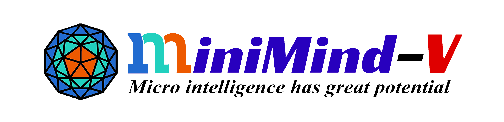
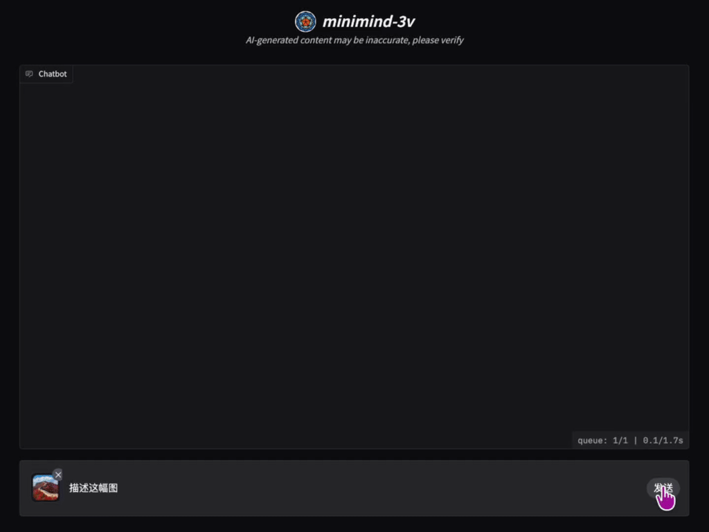
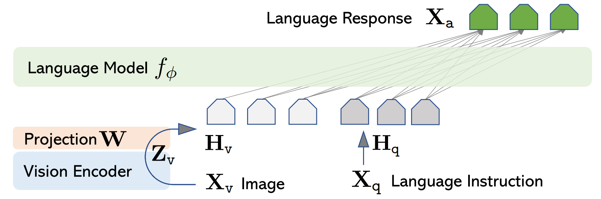
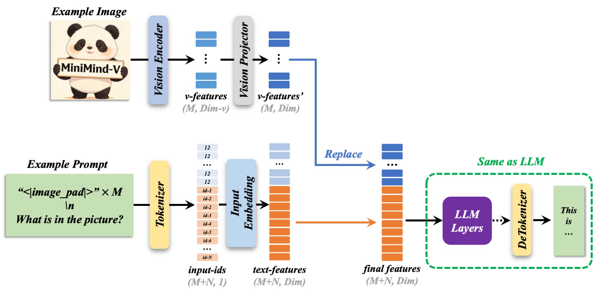
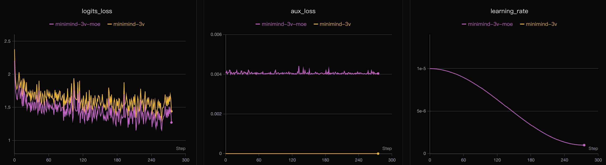
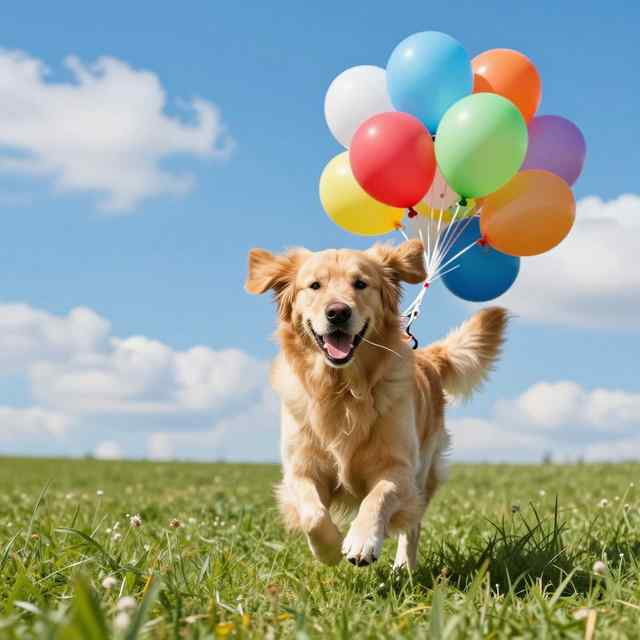
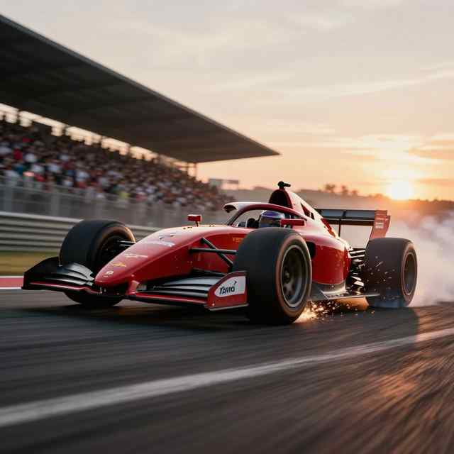

<div align="center">



</div>


<div align="center">

[](https://github.com/jingyaogong/minimind-v/stargazers)
[](LICENSE)
[](https://github.com/jingyaogong/minimind-v/commits/master)
[](https://github.com/jingyaogong/minimind-v/pulls)
[](https://huggingface.co/collections/jingyaogong/minimind-v-67000833fb60b3a2e1f3597d)

</div>

<div align="center">


</div>


<div align="center">
  <h3>"The Greatest Path is the Simplest"</h3>
</div>

<div align="center">

[中文](./README.md) | English

</div>

* This project aims to train a super-small multimodal vision-language model, **MiniMind-V**, with just a cost of 3 RMB
  and 2 hours of work, starting from scratch!
* The smallest version of **MiniMind-V** is only about $\frac{1}{2600}$ the size of GPT-3, designed to enable fast
  inference and even training on personal GPUs.
* **MiniMind-V** is an extension of the visual capabilities of the [MiniMind](https://github.com/jingyaogong/minimind)
  pure language model.
* The project includes full code for the minimalist structure of large VLM models, dataset cleaning, Pretrain, and SFT.
* This is not only the smallest implementation of an open-source VLM model but also a concise tutorial for beginners in
  vision-language models.
* The hope is that this project can provide a useful example to inspire others and share the joy of creation, helping to
  drive progress in the wider AI community!

> Note: this project is released under the Apache 2.0 license and is completely free. The "2 hours" refer to the measured time of running `1 epoch` of SFT on a single NVIDIA 3090, and the "3 RMB" refer to the GPU rental cost for that time slot.

<div align="center">



[🔗🤖 Online Experience](https://www.modelscope.cn/studios/gongjy/MiniMind-V) | [🔗🎞️ Video Introduction](https://www.bilibili.com/video/BV1Sh1vYBEzY)

</div>

# 📌 Introduction

“Building a plane with Legos is much more exciting than flying in first class!”
Is it really as complex as imagined to build a VLM-based multimodal large model? How is the code implementation done?
Is the training process difficult? Now, let's explore the answers and feel the joy of creation together!

> [!TIP]
> (As of 2026-04-20) The MiniMind-V series has completed the training of the following model versions, with the smallest
> requiring only 65M (0.065B) parameters, capable of both image recognition and conversation!

| Model (Size) | Release |
|---|---|
| minimind-3v-moe (200M-A65M) | 2026.04.20 |
| minimind-3v (65M) | 2026.04.20 |
| MiniMind2-V (104M) | 2025.02.20 |
| MiniMind2-Small-V (26M) | 2025.02.20 |
| minimind-v-v1-small (27M) | 2024.10.04 |
| minimind-v-v1 (109M) | 2024.10.04 |

### 👉**Recent Updates**

<details>
<summary> <b>2026-04-20</b> </summary>

- New checkpoints released: minimind-3v (65M) / minimind-3v-moe (200M-A65M)
- Projector: added `LayerNorm`, removed reshape token merging (P32 natively outputs 64 tokens, no downsampling needed)
- Vision Encoder switched to `SiglipVisionModel` (P32, fixed 256×256)
- Training data moved to ALLaVA-4V (Pretrain 1.27M / SFT 2.9M, merged into a single-stage SFT)
- Freeze strategy updated: `freeze_llm=1` unfreezes first + last layers; Pretrain/SFT defaults now `2`/`1`; `max_seq_len` 360 → 450
- Misc bugfixes and small tweaks

</details>

<details> 
<summary> <b>2026-04-01</b> </summary>

- Added minimind-3v (67M) and minimind-3v-moe (201M-A67M) models
- Unified 768+8 architecture, supporting both dense and moe modes
- Switched Visual Encoder from CLIP to SigLIP2 (siglip2-base-p16-256-ve)
- Replaced QFormer with MLP Projection + reshape compression
- Dataset format updated to parquet, mixed data sources, updated tokenizer with image placeholder `<|image_pad|>`, new WebUI with dynamic model directory scanning and dropdown model switching
- Model code refactored, LLM/VLM unified for Transformers format
- Training scripts support DDP multi-GPU, bfloat16 mixed precision, torch.compile acceleration

</details>

<details> 
<summary> <b>2025-10-24</b> </summary>

- Bug fix: model weights mismatch
- Adapted to ["minimind-1024 update"](https://github.com/jingyaogong/minimind)
- Code refactoring: training and evaluation scripts standardized
- Added complete checkpoint resumption support

</details>

<details>

<summary> <b>More...</b> </summary>

**2025-04-27**

- Compatibility updates
- Adapted to [MiniMind repository new features](https://github.com/jingyaogong/minimind/issues/370)
- Code normalization

**2025-02-20**

- MiniMind2-V updated alongside MiniMind2
- Significant reduction of all redundant code, standardized code format
- Major simplification of the model's redundant structure
- Updated dataset format, expanded with new SFT datasets
- Better performance than the previous VLM version!

**2024-10-05**

- MiniMind-V released on schedule, first open-source release

</details>

# 📌 Quick Start

<details>
<summary>Sharing my hardware and software configuration (for reference only)</summary>

* CPU: Intel(R) Core(TM) i9-10980XE CPU @ 3.00GHz
* RAM: 128 GB
* GPU: NVIDIA GeForce RTX 3090(24GB) * 8
* Ubuntu==20.04
* CUDA==12.2
* Python==3.10.16
* [requirements.txt](./requirements.txt)

</details>

### Step 0

```bash
# Clone the code repository
git clone --depth 1 https://github.com/jingyaogong/minimind-v
```

```bash
# Download the siglip2 model to the ./model directory
git clone https://huggingface.co/jingyaogong/siglip2-base-p32-256-ve
# or
git clone https://modelscope.cn/models/gongjy/siglip2-base-p32-256-ve
```

```bash
# Download the minimind language model to the ./out directory (as the base language model for training VLM):
# HuggingFace
https://huggingface.co/jingyaogong/minimind-3v-pytorch/blob/main/llm_768.pth
# Domestic source
https://modelscope.cn/models/gongjy/minimind-3v-pytorch/resolve/master/llm_768.pth
```


## Ⅰ Test an existing model's performance

### 1' Environment Preparation

```bash
pip install -r requirements.txt -i https://mirrors.aliyun.com/pypi/simple
```

### 2' Download the model

```bash
git clone https://huggingface.co/jingyaogong/minimind-3v
```

### 3' Command-line Q&A

```bash
# load_from='model': load native PyTorch weights, load_from='other path': load transformers format
python eval_vlm.py --load_from model --weight sft_vlm

# Or use transformers format model
python eval_vlm.py --load_from minimind-3v
```

### 4' Or start the WebUI

```bash
# ⚠️ You must first copy the transformers model folder to the ./scripts/ directory (e.g.: cp -r minimind-3v ./scripts/minimind-3v). The web_demo_vlm script will automatically scan subdirectories containing weight files; it will report an error if none are found.
cd scripts && python web_demo_vlm.py
```

## Ⅱ Train from scratch

### 1' Environment Preparation

```bash
pip install -r requirements.txt -i https://mirrors.aliyun.com/pypi/simple
```

<details>
<summary>Note: Test if Torch can use CUDA</summary>

```bash
import torch
print(torch.cuda.is_available())
```

If unavailable, download the whl file from [torch_stable](https://download.pytorch.org/whl/torch_stable.html) for
installation. Refer
to [this link](https://blog.csdn.net/weixin_45456738/article/details/141029610?ops_request_misc=&request_id=&biz_id=102&utm_term=%E5%AE%89%E8%A3%85torch&utm_medium=distribute.pc_search_result.none-task-blog-2~all~sobaiduweb~default-2-141029610.nonecase&spm=1018.2226.3001.4187)
for help.

</details>

### 2' Download Data

Download the required content from the [dataset link](https://huggingface.co/datasets/jingyaogong/minimind-v_dataset) 
and place it under `./dataset`.

<details>
<summary>Note: Dataset Details</summary>

**[Note 1]** Previously, extracting 500k fragmented image files could be very slow. From 2025-12-27, dataset format is unified to Parquet with image-text integrated storage, smaller size, no decompression needed, faster loading.

**[Note 2]** Parquet is a columnar storage format supporting efficient compression and fast reading. To preview data content, run `python lm_dataset.py` in the `dataset/` directory to visualize the first 5 image-text pairs.

Pretrain data (optional; contains caption subset only):
```bash
wget https://hf-mirror.com/datasets/jingyaogong/minimind-v_dataset/resolve/main/pretrain_i2t.parquet
```

SFT data (required; contains full caption + instruct + text merge):
```bash
wget https://hf-mirror.com/datasets/jingyaogong/minimind-v_dataset/resolve/main/sft_i2t.parquet
```

The single `sft_i2t.parquet` file (2.9M rows) absorbs Pretrain as a subset, and after global dictionary encoding dedup it is only ~10% larger than the original SFT — enough to cover every training stage.

</details>

### 3' Start Training

**3.1 Pretrain (optional)**

> `sft_i2t.parquet` already contains the Pretrain data as a subset, so **this stage can be skipped** and you may go directly to SFT with `--from_weight llm`. If you prefer the Projector to be pre-aligned first and SFT to converge more stably, run a round of Pretrain separately.

```bash
# Basic training command (start from LLM weights, train vision_proj only)
python train_pretrain_vlm.py --epochs 2 --from_weight llm
```

> Run Pretrain to get `pretrain_vlm_*.pth` as the Pretrain output weights (* is the model dimension, default 768).

**3.2 SFT (required)**

```bash
# Basic command (default --freeze_llm 1: unfreeze proj + first/last LLM layers, keep middle layers' original LLM weights)
# If 3.1 was run: --from_weight pretrain_vlm; if Pretrain was skipped: --from_weight llm
python train_sft_vlm.py --epochs 2 --from_weight pretrain_vlm
```

> Run SFT to get `sft_vlm_*.pth` as the SFT output weights.

<details>
<summary>Note: Training Details</summary>

**Training Features:**
- Support checkpoint resumption: add `--from_resume 1` parameter to continue from last interruption
- Support GPU count changes: automatically convert steps when GPU count changes during resumption
- Atomic saving: use temporary file + replacement mechanism to prevent weight corruption from interruption
- Each save generates `out/**.pth` (model weights) and `checkpoints/**_resume.pth` (training state) files

```bash
# To resume training after interruption, use the same command and add --from_resume 1
python train_sft_vlm.py --epochs 4 --from_resume 1
```

**Parameter Description:**
- `--from_weight`: base weight name (llm, pretrain_vlm, none, etc.)
- `--save_weight`: save weight prefix name
- `--from_resume`: whether to resume training (0=start from scratch, 1=continue from checkpoint)
- `--freeze_llm`: freezing strategy (0=all trainable, 1=proj + first/last LLM layers, 2=proj only). Default 2 for Pretrain, 1 for SFT
- More details can be found in the code

</details>

---

### 4' Test the Model's Performance

Ensure that the model `*.pth` file you want to test is located in the `./out/` directory.
You can also directly download the pre-trained `*.pth` file
from [here](https://huggingface.co/jingyaogong/minimind-3v-pytorch).

```bash
# Test SFT model (default)
python eval_vlm.py --weight sft_vlm

# Test Pretrain model
python eval_vlm.py --weight pretrain_vlm
```

---

> [!TIP]
> The training scripts are based on PyTorch's native framework and support multi-card acceleration. If your device has
> N (N>1) GPUs:

Single-machine N-card training method (DDP, supports multi-machine multi-card cluster)

```bash
torchrun --nproc_per_node N train_xxx.py
```

<details>
<summary>Note: Other Details</summary>

Single-machine N-card training (DeepSpeed)

```bash
deepspeed --master_port 29500 --num_gpus=N train_xxx.py
```

You can enable wandb logging during training:

```bash
# You need to log in: wandb login
torchrun --nproc_per_node N train_xxx.py --use_wandb
# and
python train_xxx.py --use_wandb
```

By adding the `--use_wandb` parameter, you can log the training process, and after training is complete, you can view
the process on the wandb website. You can specify the project name and run name by modifying the `wandb_project`
and `wandb_run_name` parameters.

[Note]: After June 2025, the domestic network environment cannot directly connect to WandB. The MiniMind project by default switches to using [SwanLab](https://swanlab.cn/) as the training visualization tool (fully compatible with WandB API), that is, just change `import wandb` to `import swanlab as wandb`, no other changes are needed.

</details>

# 📌 VLM Detail

The language backbone of MiniMind-V is the `llm_768.pth` trained by the sibling project [minimind](https://github.com/jingyaogong/minimind). The LLM's own structure, training details and experimental analysis are not repeated here; the default assumption is that the reader has a basic understanding of MiniMind LLM. Not having touched the LLM project does not prevent following the "Quick Start" to get MiniMind-V running — the flow is self-contained.

The two shorthand labels on the landing page — "from scratch" and "65M" — also need a stricter reading here. "From scratch" means the VLM itself is trained from zero (Projection randomly initialized, first/last LLM layers fine-tuned for alignment), but the LLM backbone is not pretrained from zero — it is continued from the weights of MiniMind. For a strictly "from-zero pretraining" setup, first pretrain an LLM in MiniMind and then plug it back here. "65M" refers to the trainable backbone (LLM ~64M + Projection ~1M); the SigLIP2 vision encoder contributes another ~95M parameters that stay frozen throughout and serve only as an image feature extractor, so the full model at inference time is roughly 160M (dense) / 294M (MoE).

The VLM adds a Visual Encoder and a feature projection on top of the LLM, introducing a modality-mixing branch to support multimodal inputs:


<details>
<summary> [Important] Some Interesting Thoughts </summary>

Let's take a moment to think about two questions:

* What is a **Large Language Model (LLM)**?
* What is a multimodal model?

[This article](https://www.jiqizhixin.com/articles/2024-09-15-3) perfectly aligns with my thoughts:  
Although the name "large language model" (LLM) contains the word "language," they are actually not closely related to
language; this is just a historical issue. A more accurate name would be self-regressive Transformer or something else.
LLMs are more of a general statistical modeling technology, mainly using a self-regressive Transformer to simulate token
flows. These tokens can represent text, images, audio, action choices, and even molecules—anything, really.  
Therefore, as long as the problem can be converted into a process of simulating a series of discrete tokens, LLM can
theoretically solve it. In fact, with the increasing maturity of large language model technologies, we may see more and
more problems falling under this modeling paradigm. In other words, the problem is fixed in using LLM to "predict the
next token," but the role and meaning of the tokens differ in each domain.

[ZJU-LiXi](https://person.zju.edu.cn/xilics#694283) has also mentioned a similar viewpoint (roughly stated below):  
Text, video, audio, actions, etc., are considered "multimodal" signals in human perception, but the term "modality" is
essentially just a classification concept based on how humans store information. Just like `.txt` and `.png` files,
though they differ in visual presentation and higher-level forms, they are fundamentally the same. The concept of "
multimodal" arose simply because humans need to categorize these signals based on different sensory dimensions.  
However, for machines, regardless of the signal's "modality," they are ultimately presented as a sequence of binary "
monomodal" numbers. Machines do not differentiate the origin of these signals; they just process and analyze the
information contained within these sequences.

Personally, I think **Generative Pretrained Transformer (GPT)** is a more fitting term than **Large Language Model (LLM)
**, and I prefer to use "GPT" to represent models in the LLM/VLM/GPT-like architecture series rather than to ride on
OpenAI's coattails.

To summarize what GPTs do in one sentence:

A GPT model predicts the next, next-next, next-next-next token, etc., based on the current token... until the model
outputs the end token; here, the "token" doesn’t necessarily have to be text!

```text
> For an LLM model, if we need to understand an "image," we just treat the "image" as a special "foreign language" that has never been encountered before, and translate it into the "LLM language" via a "foreign language dictionary."
> For an LLM model, if we need to understand "audio," we just treat "audio" as a special "foreign language" that has never been encountered before, and translate it into the "LLM language" via a "foreign language dictionary."
> ...
```

<u>**To obtain MiniMind-V, we only need to do these 2 things:**</u>

1. Use the **"foreign language dictionary"** that is good at translating images, to translate the image from the **"
   foreign language"** into a model-understandable **"LLM language."**
2. Fine-tune the LLM so that it and the **"foreign language dictionary"** go through a period of adaptation, thereby
   better understanding images.

The "foreign language dictionary" is referred to as the Visual Encoder model.  
Like LlaVA, Qwen-VL, and other visual language models, MiniMind-V now uses the open-source SigLIP2 series models as the
Visual Encoder.  
Specifically, we use [siglip2-base-p32-256-ve](https://huggingface.co/jingyaogong/siglip2-base-p32-256-ve), a Visual
Encoder based on the ViT-B/32 architecture for describing image-text information.  
The current SigLIP2 NaFlex vision encoder generates 64 patch tokens (256×256 image / patch_size 32 = 8×8 = 64) from the processor output as the input to the
encoder layer, which produces a 1×768 dimensional embedding vector for calculating error with the text.  
We don't need the final embedding representation, so we only take the output from the encoder layer, which is the output
feature from the core ViT backbone.  
It receives 64×768 features from the previous layer, which are projected to the LLM's hidden dimension via LayerNorm + a 2-layer MLP (Linear→GELU→Linear), resulting in 64 visual tokens fed into MiniMind-V — this step is exactly cross-modal feature alignment: the native visual features are brought into the semantic space where text tokens live, so that the two can interact in the same space.

[LlaVA-1](https://arxiv.org/pdf/2304.08485) achieves good alignment with a simple linear transformation, [LlaVA-1.5](https://arxiv.org/pdf/2310.03744) upgrades to a 2-layer MLP. MiniMind-V adopts the same MLP Projection approach as LlaVA-1.5 (P32 natively outputs 64 tokens, no additional reshape compression needed).



With that, the internal structural changes of MiniMind-V are now fully presented.

</details>


---

Next, let's briefly discuss the changes in the external input and output of MiniMind-V.

The input to the VLM is still a segment of text containing special `<image>` placeholders.  
After computing the text embedding, the vector generated by the image encoder can be projected onto the corresponding
embedding part of the placeholder, replacing the original placeholder embedding.  
For example:

```text
<image>\nWhat is in this image?
```

In `minimind-v`, the image is replaced by 64 `<|image_pad|>` tokens as placeholder (SigLIP2 P32 directly outputs 64 patch tokens, projected to 64 visual tokens via MLP),  
thus the `minimind-v` prompt becomes:

```text
<|image_pad|><|image_pad|>...<|image_pad|>(×64)\nWhat is this image describing?
```

After calculating the embedding and projection, the vision features replace the corresponding placeholder embeddings, and the rest of the computation is identical to the LLM part.



At this point, all the details of `MiniMind-V` have been presented. The VLM model subclass inherits from `MiniMind` with only **minimal** changes, core algorithm modifications `< 50 lines`, very low migration difficulty. The specific implementation may differ from `LlaVA` and similar models, but the overall idea is consistent.

# 📌 Experiment

## Ⅰ Dataset

All image-text data used in this round come from the [ALLaVA-4V](https://huggingface.co/datasets/FreedomIntelligence/ALLaVA-4V) family.
Compared with data stitched together from earlier LLaVA-derived sets, ALLaVA-4V is more consistent in quality, natively paired in Chinese and English, and more thorough in its fine-grained descriptions.
It is composed of two image sources: a curated subset of LAION (mostly natural images) and a curated subset of VFLAN (documents, charts, synthetic scenes).

- **Pretrain (`pretrain_i2t.parquet`, ~1.27M rows / ~640K unique images)**
  - `ALLaVA-Caption-LAION-4V` en/zh: ~470K + ~440K
  - `ALLaVA-Caption-VFLAN-4V` en/zh: ~195K + ~170K
  - Single-turn "describe this image" style captions used to establish the basic alignment from visual tokens to language tokens.

- **SFT (`sft_i2t.parquet`, ~2.90M rows / ~650K unique images)**
  - `ALLaVA-Instruct-LAION-4V` en/zh: ~470K + ~470K
  - `ALLaVA-Instruct-VFLAN-4V` en/zh: ~195K + ~165K
  - `Instruct-LAION-4v-gemini-claude-ensembled` (synthesized by Gemini/Claude): ~50K
  - `Instruct-LAION-4oiterative` (iteratively refined by GPT-4o): ~50K
  - Pure-text conversations (8×8 black placeholder images, preserving base language ability): ~230K
  - **Full Pretrain caption data merged in** (same source as pretrain, ~99% image overlap): ~1.27M
  - A blend of "image-grounded reasoning Q&A", "caption-style long descriptions" and "pure-text chat" — covering fine-grained follow-ups/long chains of thought as well as image description and general language ability.

Roughly 2.9M samples in total. The Pretrain stage can be skipped entirely (SFT has absorbed it as a subset). Chinese and English are roughly balanced.
Given MiniMind-V's trainable backbone is only 65M, mixing English and Chinese is a pragmatic choice: Chinese data helps native-language generation, while the original English descriptions tend to be more precise — the two complement each other.

All images are `resize`d to **256×256** (matching SigLIP2 NaFlex's input specification; P32 produces 64 patch tokens) and re-encoded as JPEG, packed directly into parquet.

(`pretrain_i2t.parquet`) Pre-training dataset format:

```text
Columns: conversations (json string), image_bytes (binary)

conversations example:
[
  {"role": "user", "content": "<image>\nPlease describe this image in detail."},
  {"role": "assistant", "content": "The image shows..."}
]
image_bytes: <binary image data>
```

(`sft_i2t.parquet`) Single-image SFT dataset format:

```text
Columns: conversations (json string), image_bytes (binary)

conversations example:
[
  {"role": "user", "content": "Based on the image, what time of day is it?<image>"},
  {"role": "assistant", "content": "Judging from the light and shadows..."}
]
image_bytes: <binary image data>
```

> Note: sft_i2t.parquet contains ~2.9M samples, of which ~1.40M are image instruct conversations, ~1.27M are image caption descriptions (merged from Pretrain), and ~230K are pure-text conversations (t2t, image column filled by an 8×8 black placeholder) used to preserve the model's base language capabilities. Since Pretrain is already included as a subset, the Pretrain stage can be skipped and SFT run directly.

Dataset download link: ([ModelScope](https://www.modelscope.cn/datasets/gongjy/minimind-v_dataset) | [HuggingFace](https://huggingface.co/datasets/jingyaogong/minimind-v_dataset))

## Ⅱ Training

Training has two stages (Pretrain optional; SFT required). Both freeze the Visual Encoder and train only the Projection and part of the LLM layers.
Training is initialized from LLM Pretrain weights, with support for DDP multi-GPU training, mixed precision (bfloat16), torch.compile acceleration, and swanlab logging.

> train_pretrain_vlm (optional)

The Pretrain stage learns general image knowledge from ~1.27M image-text description pairs (e.g., a deer is a deer, a dog is a dog).
It uses a higher learning rate (~4e-4), max sequence length 450, and **fully freezes the LLM and Visual Encoder, training only the Projection** (`--freeze_llm 2`).
The goal is to let the Projector cleanly align visual tokens to the language space without perturbing the original LLM weights.
Since SFT data already contains all Pretrain samples as a subset, this stage is optional; skipping it saves time, while **running one round of Pretrain first lets the Projector pre-align and makes SFT converge more steadily**.

> train_sft_vlm

The SFT stage uses the aforementioned `sft_i2t.parquet` — about 2.9M mixed samples, covering the image captions inherited from Pretrain, reasoning-style Q&A on natural images, fine-grained Q&A on documents/charts, instructions synthesized by Gemini/Claude/GPT-4o, plus ~230K pure-text conversations (image column filled by an 8×8 black placeholder). Learning rate drops to ~5e-6, max sequence 768.

A common practice is to fully unfreeze the LLM during SFT, but this usually assumes a several-B-parameter base and a substantial amount of pure-text data mixed into SFT. MiniMind-V's language backbone is only 64M and ~92% of the current SFT data is image-related, so fully unfreezing the LLM would likely dilute its original general-language capability under the image-task gradients.

We therefore use `--freeze_llm 1`: **only the Projection and the first & last LLM layers are unfrozen, while the remaining N-2 layers keep their Pretrain weights**. The first layer is the first processing stage after visual tokens enter the LLM and thus bears the cross-modal fusion; the last layer shapes the format and style of the answer; the middle layers retain the knowledge from LLM Pretrain and are not overwritten by image-task gradients. The ~230K pure-text samples further act as a regularizer for general-language capability.

> Training Time and Loss Trend (for reference only)

On a single NVIDIA 3090, SFT takes ~2 hours per `epoch` in practice; dense and MoE finish in similar time (activated parameters are on the same order, with the gap mostly coming from the extra memory traffic of expert routing). Pretrain data volume is ~45% of SFT's, so one Pretrain epoch can be roughly scaled by that ratio. At a typical cloud price of ~1.5 RMB/hour for a 3090, a full SFT round costs about 3 RMB.

Pretrain [768+8] (dense & moe)  


SFT [768+8] (dense & moe)  


## Ⅲ Model Weights

| Format | ModelScope | HuggingFace |
|---|---|---|
| Native PyTorch (`*.pth`) | [minimind-3v-pytorch](https://www.modelscope.cn/models/gongjy/minimind-3v-pytorch) | [minimind-3v-pytorch](https://huggingface.co/jingyaogong/minimind-3v-pytorch) |
| Transformers | [minimind-v collection](https://modelscope.cn/collections/MiniMind-V-42b841dde22d41) | [minimind-v collection](https://huggingface.co/collections/jingyaogong/minimind-v-67000833fb60b3a2e1f3597d) |

> Note: The Transformers version is the `MiniMind-V` model after single-image SFT

# 📌 Test

### Effect Test

Prompt: `<image>\nPlease illustrate the image through your words.`

<table>
  <thead>
    <tr>
      <th>image</th>
      <th>minimind-3v</th>
      <th>minimind-3v-moe</th>
    </tr>
  </thead>
  <tbody>
    <tr>
      <td>
        
        &nbsp;&nbsp;&nbsp;&nbsp;&nbsp;&nbsp;&nbsp;&nbsp;&nbsp;&nbsp;&nbsp;&nbsp;&nbsp;&nbsp;&nbsp;&nbsp;&nbsp;&nbsp;&nbsp;&nbsp;&nbsp;&nbsp;&nbsp;&nbsp;&nbsp;&nbsp;&nbsp;&nbsp;&nbsp;&nbsp;&nbsp;&nbsp;&nbsp;&nbsp;&nbsp;&nbsp;&nbsp;&nbsp;&nbsp;&nbsp;
      </td>
      <td>The image features a golden retriever in mid-motion, captured in mid-air, with its head tilted towards the camera. The dog, which appears to be a Golden Retriever, is in motion, with its tongue slightly out of focus, suggesting it's either waiting or turning. It has a distinctive blue tongue, which is a common feature in many dog breeds. The dog is standing on a grassy field with a few scattered clouds, and its mouth is open as if it is about to take a bite. The sky is partly cloudy, indicating fair weather. The lighting suggests it's daytime with ample sunlight, casting soft shadows on the grass and the grass.</td>
      <td>The image features a golden golden-brown dog with a slightly furrowed brow, likely in motion, as if in mid-motion. It's captured in a bright, natural setting, with a clear sky above and a clear blue sky above. The dog appears to be a German Shepherd, given its size and the prominence of its tongue and the bright red of its tongue. The dog's ears are perked up, suggesting it may be a pet. The grass is a vibrant green, and the sky is clear with no visible clouds, indicating good weather. There is a sense of motion in the photograph, with the dog's head tilted downwards and its eyes looking towards the sky.</td>
    </tr>
    <tr>
      <td>
        
        &nbsp;&nbsp;&nbsp;&nbsp;&nbsp;&nbsp;&nbsp;&nbsp;&nbsp;&nbsp;&nbsp;&nbsp;&nbsp;&nbsp;&nbsp;&nbsp;&nbsp;&nbsp;&nbsp;&nbsp;&nbsp;&nbsp;&nbsp;&nbsp;&nbsp;&nbsp;&nbsp;&nbsp;&nbsp;&nbsp;&nbsp;&nbsp;&nbsp;&nbsp;&nbsp;&nbsp;&nbsp;&nbsp;&nbsp;&nbsp;
      </td>
      <td>The image shows a rain-shaped umbrella with a gradient of colors ranging from yellow to blue. The umbrella's umbrella is visible, showing a multicolored rainbow pattern with the gradient of colors. The water is illuminated by the rain, suggesting recent rain. The rainbow has a distinctive gradient of colors, primarily red, green, blue, yellow, and white, with the darker colors and the lighter colors on the umbrella's surface. In the background, there are buildings with red-roofed buildings, indicating a residential area. The weather appears overcast, and the lighting is soft, with no harsh shadows, indicating either early morning or late afternoon.</td>
      <td>The image shows a rainbow umbrella in the midground, with a faint reflection of the umbrella. The umbrella is orange with a black fabric, and it is surrounded by a misty effect, suggesting the umbrella is illuminated. The umbrella is turned off, with its umbrella open in the middle ground, showing its umbrella open. The mist appears to be frosted, as indicated by the reflection of the umbrella. The background is blurred but shows an urban setting with buildings, possibly a street, and the sky is overcast. There is no discernible human activity in the image.</td>
    </tr>
    <tr>
      <td>
        
        &nbsp;&nbsp;&nbsp;&nbsp;&nbsp;&nbsp;&nbsp;&nbsp;&nbsp;&nbsp;&nbsp;&nbsp;&nbsp;&nbsp;&nbsp;&nbsp;&nbsp;&nbsp;&nbsp;&nbsp;&nbsp;&nbsp;&nbsp;&nbsp;&nbsp;&nbsp;&nbsp;&nbsp;&nbsp;&nbsp;&nbsp;&nbsp;&nbsp;&nbsp;&nbsp;&nbsp;&nbsp;&nbsp;&nbsp;&nbsp;
      </td>
      <td>The image features a vibrant pink bicycle on a paved road, with a lush green palette dominated by pink and white blooms. The bicycle is positioned on a road, with a slightly elevated position and a brown handlebar on the right. The bicycle is positioned on a paved road, with a pedestal area visible on the left side of the frame, and a small, round, wooden frame with a rounded top. The bicycle is positioned in front of a white bicycle, and the background is softly blurred, with no discernible features that suggest a location or setting. The lighting is bright, and the overall mood of the image is peaceful and serene.</td>
      <td>The image features a vibrant pink pink scene on a street during the daytime. In the foreground, there's a large, classic bicycle with a sleek design, featuring a classic bike with a brown handlebar and a black frame. The bike has a blue handlebar and a chain strap, indicating it is designed for carrying luggage. Behind the bicycle, a series of pink blossoms and green foliage are visible, suggesting a garden or park setting. The background is blurred, with the focus on the pink and bicycle, which is the central subject of the image. The overall setting appears to be a serene, sunny day, with a clear sky and gentle lighting in the background.</td>
    </tr>
    <tr>
      <td>
        
        &nbsp;&nbsp;&nbsp;&nbsp;&nbsp;&nbsp;&nbsp;&nbsp;&nbsp;&nbsp;&nbsp;&nbsp;&nbsp;&nbsp;&nbsp;&nbsp;&nbsp;&nbsp;&nbsp;&nbsp;&nbsp;&nbsp;&nbsp;&nbsp;&nbsp;&nbsp;&nbsp;&nbsp;&nbsp;&nbsp;&nbsp;&nbsp;&nbsp;&nbsp;&nbsp;&nbsp;&nbsp;&nbsp;&nbsp;&nbsp;
      </td>
      <td>The image shows a bright yellow sports car positioned on a paved road. The car has a distinctive design with a long streamlined body, aerodynamic contours, and a long, streamlined body, typical of high-performance sports cars. The car's headlights are aerodynamic, and it has a low profile, aerodynamic brake, and a short, streamlined body. The windows appear to be tinted, and there's a clear sky above and a clear blue sky with few clouds. The car is parked on a road, with a hint of a flatbed traffic in the distance, indicating that this may be a busy road trip. The watermark "LOCKERS" is visible on the bottom right corner of the image, suggesting that this image may have been taken by a professional photographer or a promotional material.</td>
      <td>The image features a bright yellow sports car parked on a paved asphalt surface. The car is a sleek, aerodynamic design with a sleek, sporty body, aerodynamic lines, and aerodynamic bodywork. Its design suggests a modern, sporty aesthetic with a sporty appearance. The car's headlights are narrow and integrated into the design, with the headlights appearing to be short and streamlined, indicating a design that is likely sporty. The windows are tinted, and the vehicle is equipped with a black and white livery, which provides a contrast to the vibrant colors of the car. The sky is partly cloudy, with no clouds visible, suggesting a fair weather day. There are no people or other objects in the frame, placing the entire focus on the car.</td>
    </tr>
    <tr>
      <td>
        
        &nbsp;&nbsp;&nbsp;&nbsp;&nbsp;&nbsp;&nbsp;&nbsp;&nbsp;&nbsp;&nbsp;&nbsp;&nbsp;&nbsp;&nbsp;&nbsp;&nbsp;&nbsp;&nbsp;&nbsp;&nbsp;&nbsp;&nbsp;&nbsp;&nbsp;&nbsp;&nbsp;&nbsp;&nbsp;&nbsp;&nbsp;&nbsp;&nbsp;&nbsp;&nbsp;&nbsp;&nbsp;&nbsp;&nbsp;&nbsp;
      </td>
      <td>The image depicts a man standing on a raised, stern, ornate torch. He is dressed in a vibrant red and blue suit with a white shirt and a red swoosh on his head. His suit is adorned with a red cross, suggesting a superhero's personal style. The torch is illuminated with warm light, possibly from the sun, creating a soft, diffused light that enhances the three-dimensional effect. The sky is partly cloudy, indicating either early morning or late afternoon light. The terrain is populated with numerous high-rise buildings, some of which have a tall, slender building with a white roof. The buildings appear to be part of a cityscape, possibly in the United States. The sky is partly cloudy, suggesting it's either sunrise or sunset. The image is taken during the golden hour, with the sun setting behind the torch and the sky.</td>
      <td>The image features a female superhero standing on a steeplewheeled rooftop. She is dressed in a blue and red suit with a sleeveless blue top, which is red with a large, bold front opening. The suit is complemented by a red belt with a silver buckle, which is a characteristic feature of the superhero's superhero. Her hair is styled in a bun, and she has a confident stance with one hand on her hip and the other holding a weapon. The background is a clear sky with a gradient of warm colors, suggesting either dawn or dusk, with the sun setting in the background being the bright sunlight. The sky is a gradient of warm colors, transitioning from a warm yellow near the horizon to a deeper blue as it moves towards the sky.</td>
    </tr>
    <tr>
      <td>
        
        &nbsp;&nbsp;&nbsp;&nbsp;&nbsp;&nbsp;&nbsp;&nbsp;&nbsp;&nbsp;&nbsp;&nbsp;&nbsp;&nbsp;&nbsp;&nbsp;&nbsp;&nbsp;&nbsp;&nbsp;&nbsp;&nbsp;&nbsp;&nbsp;&nbsp;&nbsp;&nbsp;&nbsp;&nbsp;&nbsp;&nbsp;&nbsp;&nbsp;&nbsp;&nbsp;&nbsp;&nbsp;&nbsp;&nbsp;&nbsp;
      </td>
      <td>The image captures a dynamic scene of a Ford Motor Company in mid-air, captured during twilight. The car is a Ford Motor Company, characterized by its sleek, aerodynamic design, with a high-performance tires suitable for diesel and aerodynamics. The car is equipped with a low-profile tires, which suggests it is designed for high-speed racing. The tires are marked with red and white markings, indicating a slightly rapid trajectory. The sky is clear with a soft gradient from light blue to orange near the horizon, suggesting either dawn or dusk. The racing has a modern design, with a prominent grille and side mirrors, which are characteristic of Motor Company's racing team. There are no visible race or other people in the immediate vicinity of the car. The car is on a track, indicating its position as a driver, and the background features a crowd of spectators, indicating the location might be in a competitive or high-speed racing area.</td>
      <td>The image depicts a dynamic scene at what appears to be a Formula One race car. The car is a two-person turbo-drive, indicated by the slight blur on the wheels, which suggests it is moving from left to right. The driver is wearing a full-face helmet with a visor, a white grille with a red and black design, and a red and black stripe on the left side of the front wheel. The car is sporty, with a sleek design, and is in motion, as indicated by the blur of the background. The background features a high-speed turn signal at the front, which is likely the car's trackside. The sky is clear with a few scattered clouds, suggesting the sun is either in the sky or the sun is low in the sky. There are no people visible in the image, focusing the attention solely on the driver and the car.</td>
    </tr>
  </tbody>
</table>

### Effect Summary:

Both models correctly identify the primary subject across all 6 samples (dog, umbrella, bicycle, sports car, superhero, racecar) with 6/6 subject recognition, though both still exhibit some repetitive phrasing and hallucinated details, placing overall performance at a stage of "understanding the gist but inaccurate on details".

The MoE variant produces richer scene descriptions with better capture of background environments (urban streets, city skylines, sunset gradients) and object details (rainbow patterns, blue-red suit colors, racecar livery). The Dense model tends to be more concise with less repetition. Both exhibit similar levels of hallucination, with occasional inaccuracies in local details.

Visual signals act as a special "foreign language" to the LLM, so the ceiling of "learning that language" is bounded by the LLM's own language ability. A stronger backbone extracts more value from the same image-text data; swapping MiniMind-V's backbone for a several-B-scale LLM yields clearly sharper details and more coherent reasoning.

#### Future Areas for Improvement:

```text
> Introduce dynamic resolution and Tile-based encoding (like LLaVA-NeXT) to break through the fixed resolution limit.
> Visual Encoder could be upgraded to stronger vision encoders for finer-grained image features.
> Extend multi-image understanding, video understanding, and Visual Grounding capabilities.
> ...
```

# 📌 Acknowledge

> [!TIP]
> If `MiniMind-V` is useful to you, a ⭐ on GitHub is welcome. <br/>
> Issues and PRs are the best place to share problems or improvements found while using the project.

## 🤝 [Contributors](https://github.com/jingyaogong/minimind-v/graphs/contributors)

<a href="https://github.com/jingyaogong/minimind-v/graphs/contributors">
  
</a>

## 😊 Acknowledgments

<a href="https://github.com/xinyanghuang7"><b>@xinyanghuang7</b></a>: <a href="https://github.com/xinyanghuang7/minimind-v/tree/hxy">Multi-image VLM branch</a> | <a href="https://github.com/jingyaogong/minimind-v/tree/32cf4c5c01337231fd907b92d513de8945594263">Repository provided up to this version</a> 

<details> 
<summary> <b>Reference Links & Thanks to the following excellent papers or projects</b> </summary>

- No particular order
- [LlaVA](https://arxiv.org/pdf/2304.08485)
- [LlaVA-VL](https://arxiv.org/pdf/2310.03744)
- [Chinese-LLaVA-Vision-Instructions](https://huggingface.co/datasets/LinkSoul/Chinese-LLaVA-Vision-Instructions)

</details>

## 🫶Supporter

<a href="https://github.com/jingyaogong/minimind-v/stargazers">
    <picture>
      <source media="(prefers-color-scheme: dark)" srcset="https://bytecrank.com/nastyox/reporoster/php/stargazersSVG.php?user=jingyaogong&repo=minimind-v&theme=dark"/>
      <source media="(prefers-color-scheme: light)" srcset="https://bytecrank.com/nastyox/reporoster/php/stargazersSVG.php?user=jingyaogong&repo=minimind-v"/>
      
    </picture>
</a>

<a href="https://github.com/jingyaogong/minimind-v/network/members">
    <picture>
      <source media="(prefers-color-scheme: dark)" srcset="https://bytecrank.com/nastyox/reporoster/php/forkersSVG.php?user=jingyaogong&repo=minimind-v&theme=dark"/>
      <source media="(prefers-color-scheme: light)" srcset="https://bytecrank.com/nastyox/reporoster/php/forkersSVG.php?user=jingyaogong&repo=minimind-v"/>
      
    </picture>
</a>

<picture>
  <source media="(prefers-color-scheme: dark)" srcset="https://api.star-history.com/svg?repos=jingyaogong/minimind-v&type=Date&theme=dark"/>
  <source media="(prefers-color-scheme: light)" srcset="https://api.star-history.com/svg?repos=jingyaogong/minimind-v&type=Date"/>
  
</picture>

# 🎓 Citation

If you find MiniMind-V helpful in your research or work, please cite:

```bibtex
@misc{minimind-v,
  title = {MiniMind-V: Train a Tiny VLM from Scratch},
  author = {Jingyao Gong},
  year = {2024},
  url = {https://github.com/jingyaogong/minimind-v},
  note = {GitHub repository, accessed 2026}
}
```

# 📜 License

This repository is licensed under the [Apache-2.0 License](LICENSE).

