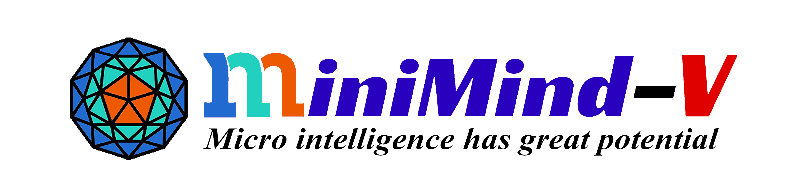

# <strong>Welcome to MiniMind-V!</strong>

<figure markdown>
  
  <figcaption><strong>"The Greatest Path is the Simplest"</strong></figcaption>
</figure>

## 📌 Introduction

MiniMind-V is a super-small multimodal vision-language model project trained completely from scratch, requiring **only 1.3 RMB + 1 hour** to train a **26M** parameter vision-language model!

- **MiniMind-V** series is extremely lightweight, the smallest version is **1/7000** the size of GPT-3
- **MiniMind-V** is an extension of the visual capabilities of the [MiniMind](https://github.com/jingyaogong/minimind) pure language model
- The project open-sources the minimalist structure of VLM models, including:
  - Dataset cleaning
  - Pretraining
  - Supervised Fine-Tuning (SFT)
  - Multi-image dialogue support
- All core algorithm code is reconstructed from scratch using native PyTorch, without relying on third-party abstract interfaces
- This is not only a full-stage open-source reproduction of vision-language models, but also a concise tutorial for getting started with VLMs

!!! note "Training Cost"
    "1 hour" is based on NVIDIA 3090 hardware (single card) testing `1 epoch`, "1.3 RMB" refers to GPU server rental cost

## ✨ Key Features

- **Ultra-low cost**: Single 3090, 1 hour, 1.3 RMB to train a vision-language model from scratch
- **Complete pipeline**: Covers Visual Encoder, Projection, Pretraining, SFT full process
- **Education-friendly**: Clean code, suitable for learning VLM principles
- **Ecosystem compatible**: Supports `transformers` and mainstream inference frameworks

## 📊 Model List

| Model (Size)            | Inference Memory (Approx.) | Release    |
|------------------------|----------------------------|------------|
| MiniMind2-V (104M)     | 0.6 GB                     | 2025.02.20 |
| MiniMind2-Small-V (26M) | 1.1 GB                    | 2025.02.20 |
| minimind-v-v1-small (27M) | 0.6 GB                  | 2024.10.04 |
| minimind-v-v1 (109M)   | 1.1 GB                     | 2024.10.04 |

## 🚀 Quick Navigation

- [Quick Start](quickstart.md) - Environment setup, model download, quick testing
- [Model Training](training.md) - Pretraining, SFT training full process

## 🔗 Related Links

- **GitHub**: [https://github.com/jingyaogong/minimind-v](https://github.com/jingyaogong/minimind-v)
- **HuggingFace**: [MiniMind-V Collection](https://huggingface.co/collections/jingyaogong/minimind-v-67000833fb60b3a2e1f3597d)
- **ModelScope**: [MiniMind-V Models](https://www.modelscope.cn/profile/gongjy)
- **Online Demo**: [ModelScope Studio](https://www.modelscope.cn/studios/gongjy/MiniMind-V)

## 🎯 Project Highlights

**"Building a plane with Legos is much more exciting than flying in first class!"**

Is it really as complex as imagined to build a VLM-based multimodal large model? How is the code implementation done? Is the training process difficult?

Now, let's explore the answers and feel the joy of creation together!

<figure markdown>
  
</figure>

## 📚 Core Concepts

### What is a Vision-Language Model (VLM)?

A Vision-Language Model is a multimodal model that can understand both images and text simultaneously. MiniMind-V achieves this through:

1. Using a **Visual Encoder** (CLIP model) to convert images into feature vectors
2. Aligning visual and text feature spaces through a **Projection layer**
3. Injecting image features into the language model to enable image-text understanding

### MiniMind-V Design Philosophy

- **Minimal modifications**: Based on the MiniMind language model, only adding Visual Encoder and Projection submodules
- **Core algorithm changes < 50 lines**: Extremely low migration difficulty
- **Simple yet effective**: Uses linear projection for cross-modal alignment, simple but effective

## 🎓 Target Audience

- Beginners who want to understand vision-language model principles
- Researchers who want to quickly build VLM prototypes
- Developers interested in multimodal large models
- Teams needing low-cost training of customized vision-language models

## 💡 Get Started

Ready? Let's start your VLM journey from the [Quick Start](quickstart.md) page!
