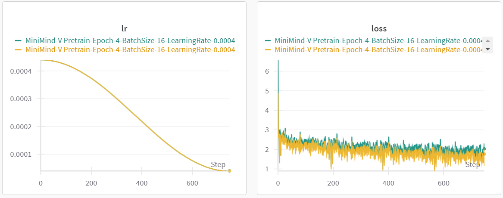
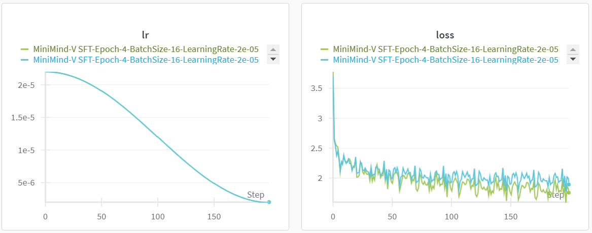
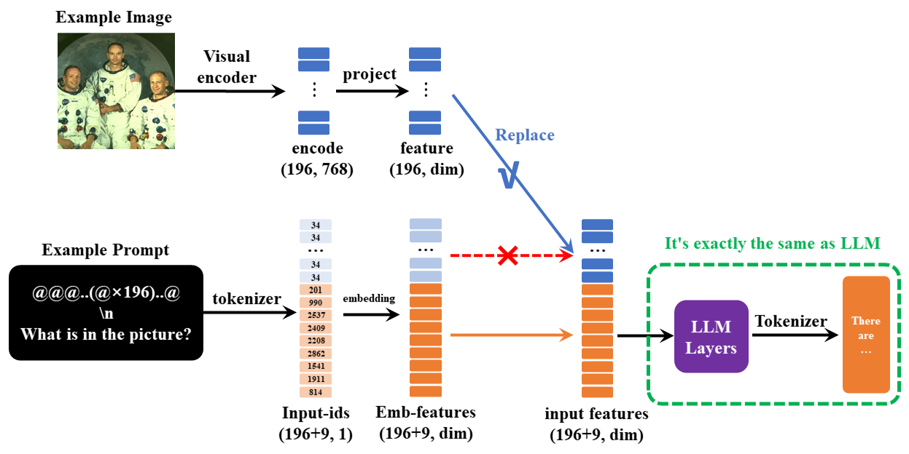

# Model Training

This page introduces how to train MiniMind-V vision-language models from scratch.

## 📊 Data Preparation

### 1. Download Dataset

Download datasets from the following addresses:

- [ModelScope - minimind-v_dataset](https://www.modelscope.cn/datasets/gongjy/minimind-v_dataset)
- [HuggingFace - minimind-v_dataset](https://huggingface.co/datasets/jingyaogong/minimind-v_dataset)

Create `./dataset` directory and place data files:

```bash
./dataset/
├── pretrain_vlm_data.jsonl        # Pretrain data (~595K samples)
├── sft_vlm_data.jsonl             # Single-image SFT data (~300K samples)
├── sft_vlm_data_multi.jsonl       # Multi-image SFT data (~13.6K samples)
├── eval_images/                   # Test images
│   ├── 城市车水马龙-city-traffic.jpg
│   ├── 熊猫草地-Panda-Grassland.jpg
│   └── ...
└── sft_multi_images_trans_image.zip  # Multi-image data images (needs extraction)
```

!!! tip "Dataset Notes"
    - `*.jsonl` are Q&A datasets
    - `*images` are accompanying image data, need to be extracted after download
    - Please reserve about 5GB space for the dataset
    - If space is insufficient, try skipping pretrain and go directly to SFT training

### 2. Data Format

**Pretrain Data Format** (`pretrain_vlm_data.jsonl`):

```json
{
  "conversations": [
    {
      "role": "user",
      "content": "Provide a brief description of the given image.\n<image>"
    },
    {
      "role": "assistant",
      "content": "Olive oil is a healthy ingredient for free use."
    }
  ],
  "image": "GCC_train_002582585.jpg"
}
```

**Single-Image SFT Data Format** (`sft_vlm_data.jsonl`):

```json
{
  "conversations": [
    {
      "role": "user",
      "content": "What impact does the location of the alarm clock have on sleep quality?<image>"
    },
    {
      "role": "assistant",
      "content": "Place the digital alarm clock on the nightstand..."
    }
  ],
  "image": "train-00000-of-00001_image_0_0.jpg"
}
```

**Multi-Image SFT Data Format** (`sft_vlm_data_multi.jsonl`):

```json
{
  "conversations": [
    {
      "role": "user",
      "content": "context: Source Image: <image> Target Image: <image> Instruction: What is the correct image edit instruction?<image>"
    },
    {
      "role": "assistant",
      "content": "take the people out of the back in the photo..."
    }
  ],
  "image": "0.jpg, 1.jpg"
}
```

### 3. Data Source

- **Pretrain Data**: [Chinese-LLaVA-Vision](https://huggingface.co/datasets/LinkSoul/Chinese-LLaVA-Vision-Instructions)
  - Approximately 570,000 images from CC-3M and COCO 2014
  
- **SFT Data**: [llava-en-zh-300k](https://huggingface.co/datasets/BUAADreamer/llava-en-zh-300k)
  - 300K instruction fine-tuning data
  - 150K images
  - Translated content, better Chinese support

## 🎯 Training Pipeline

All training scripts are located in the `./trainer` directory.

### Step 0: Prepare Base Language Model

Download pure language model weights to the `./out` directory (as the base language model for training VLM):

```bash
# Download 512-dim model
wget https://huggingface.co/jingyaogong/MiniMind2-V-PyTorch/blob/main/llm_512.pth

# Or download 768-dim model
wget https://huggingface.co/jingyaogong/MiniMind2-V-PyTorch/blob/main/llm_768.pth
```

### Step 1: Pretraining (Learning Image Description)

The pretraining stage teaches the model general image knowledge, such as a deer is a deer, a dog is a dog.

```bash
# Basic training command (start from LLM weights, train vision_proj only)
python trainer/train_pretrain_vlm.py --epochs 4 --from_weight llm

# Multi-GPU training
torchrun --nproc_per_node 2 trainer/train_pretrain_vlm.py --epochs 4 --from_weight llm

# Resume training from checkpoint
python trainer/train_pretrain_vlm.py --epochs 4 --from_resume 1
```

**Output weights**: `./out/pretrain_vlm_*.pth` (* is the model dimension, default is 512)

!!! info "Training Duration"
    - MiniMind2-Small-V (26M): ~1h (single 3090)
    - MiniMind2-V (104M): ~3h (single 3090)

**Training Strategy**:
- Freeze Visual Encoder (CLIP model) gradients
- Freeze LLM main parameters (only last layer learnable via `--freeze_llm True`)
- Only train Vision Projection layer

**Key Parameters**:
- `--from_weight llm`: Start from LLM weights
- `--freeze_llm True`: Freeze LLM parameters (pretrain only)
- `--from_resume 1`: Resume from checkpoint
- `--save_weight pretrain_vlm`: Save weight prefix name

**Loss Curve**:



### Step 2: Supervised Fine-Tuning (Learning Image-Caption Dialogue Style)

The SFT stage teaches the model real image-text dialogue format, better aligning with human communication habits.

```bash
# Basic training command (start from pretrain weights, full parameter fine-tuning)
python trainer/train_sft_vlm.py --epochs 2 --from_weight pretrain_vlm

# Multi-GPU training
torchrun --nproc_per_node 2 trainer/train_sft_vlm.py --epochs 2 --from_weight pretrain_vlm

# Resume training from checkpoint
python trainer/train_sft_vlm.py --epochs 4 --from_resume 1
```

**Output weights**: `./out/sft_vlm_*.pth`

!!! info "Training Duration"
    - MiniMind2-Small-V: ~1h (single 3090)
    - MiniMind2-V: ~3h (single 3090)

**Training Strategy**:
- Freeze Visual Encoder (CLIP model) gradients
- Train Vision Projection layer (all parameters learnable)
- Train LLM (all parameters learnable)

**Key Parameters**:
- `--from_weight pretrain_vlm`: Start from pretrain weights
- `--from_resume 1`: Resume from checkpoint
- `--save_weight sft_vlm`: Save weight prefix name

**Loss Curve**:



### Step 3 (Optional): Multi-Image Fine-Tuning

Multi-image fine-tuning provides a demo example based on bird comparison dataset.

```bash
python train_sft_vlm.py --epochs 4 --use_multi_image
```

**Notes**:
- Multi-image dataset is relatively small and contains English conversations
- Only includes two-image comparison scenarios
- Fine-tuning effect is limited, provided as a reference approach

!!! warning "Training Notes"
    **Training Features:**
    
    - **Checkpoint Resumption**: Add `--from_resume 1` parameter to continue from last interruption
    - **GPU Count Changes**: Automatically convert steps when GPU count changes during resumption
    - **Atomic Saving**: Use temporary file + replacement mechanism to prevent weight corruption
    - **Dual File System**: Each save generates `out/**.pth` (model weights) and `checkpoints/**_resume.pth` (training state)
    
    **Resume Example:**
    ```bash
    # Resume training after interruption
    python trainer/train_sft_vlm.py --epochs 4 --from_resume 1
    ```

## 📈 Model Architecture Details

MiniMind-V's structure only adds Visual Encoder and feature projection submodules:


### Core Components

1. **Visual Encoder**
   - Uses [clip-vit-base-patch16](https://huggingface.co/openai/clip-vit-base-patch16)
   - Based on ViT-B/16 architecture
   - Input image: 224×224
   - Patch size: 16×16
   - Output: 196×768 dimensional features (196 visual tokens)

2. **Projection Layer**
   - Simple unbiased linear transformation
   - Functions:
     - Aligns 768-dimensional visual tokens to LLM text tokens
     - Maps image features to the same space as text embeddings
   - Achieves cross-modal feature alignment

3. **Language Model**
   - Fully inherits from MiniMind
   - Minimal modifications (core algorithm changes < 50 lines)

### Input-Output Mechanism

**Input Format**:

In `minimind-v`, a 196-character `@@@...@@@` placeholder is used to replace the image:

```text
@@@......@@@\nWhat is this image describing?
```

Why 196 characters? Because any image is encoded by the CLIP model as 196×768 dimensional tokens.



**Multi-Image Implementation**:

Achieved by injecting multiple `<image>` placeholders, no framework modification needed.

### Model Parameter Configuration

| Model Name | Params | d_model | n_layers | kv_heads | q_heads | Visual Token |
|-----------|--------|---------|----------|----------|---------|--------------|
| MiniMind2-Small-V | 26M | 512 | 8 | 2 | 8 | 196×768 |
| MiniMind2-V | 104M | 768 | 16 | 2 | 8 | 196×768 |

## 🧪 Test Model

### Test Trained Model

Ensure the model `*.pth` file to be tested is in the `./out/` directory.

```bash
# Test SFT model (default)
python eval_vlm.py --weight sft_vlm

# Test pretrain model
python eval_vlm.py --weight pretrain_vlm

# Specify image directory
python eval_vlm.py --weight sft_vlm --image_dir ./dataset/eval_images/
```

### Use Pre-Trained Model

You can also directly download and use pre-trained `*.pth` files:

- [HuggingFace - MiniMind2-V-PyTorch](https://huggingface.co/jingyaogong/MiniMind2-V-PyTorch)
- [ModelScope - MiniMind2-V-PyTorch](https://www.modelscope.cn/models/gongjy/MiniMind2-V-PyTorch)

## 🔧 Multi-GPU Training

### DDP Method

```bash
torchrun --nproc_per_node N train_xxx.py
```

### DeepSpeed Method

```bash
deepspeed --master_port 29500 --num_gpus=N train_xxx.py
```

### Wandb Monitoring

```bash
# Login first
wandb login

# Enable wandb
torchrun --nproc_per_node N train_xxx.py --use_wandb
```

By adding the `--use_wandb` parameter, you can log the training process. After training, you can view the process on the wandb website.

You can specify the project name and run name by modifying `wandb_project` and `wandb_run_name` parameters.

## 💰 Training Cost

Based on single NVIDIA 3090:

| Dataset Combination | Training Time | Cost (Approx.) | Effect |
|---------------------|---------------|----------------|---------|
| pretrain (1 epoch) + sft (1 epoch) | 2h | ≈1.3 RMB | 😊😊😊 Basic dialogue |
| pretrain (4 epochs) + sft (4 epochs) | 8h | ≈5.4 RMB | 😊😊😊😊😊 Better effect |

!!! success "Quick Reproduction"
    Using single epoch of pretrain and SFT, single 3090 only needs **2 hours + 1.3 RMB** to train a vision-language ChatBot!

## 📝 Training Tips

### 1. Reduce Memory Usage

- Use smaller batch size
- Use 512-dim model instead of 768
- Enable gradient checkpointing (if implemented)
- Use DeepSpeed ZeRO optimization

### 2. Accelerate Training

- Use multi-GPU training (DDP or DeepSpeed)
- Use mixed precision training (FP16)
- Reduce image resolution (but may affect performance)

### 3. Improve Performance

- Increase training epochs
- Use larger model (768 vs 512)
- Use higher quality datasets
- Adjust learning rate

### 4. Checkpoint Resumption

MiniMind-V now supports complete checkpoint resumption:

- **Automatic Saving**: Training state saved every N steps (default 100)
- **Easy Resumption**: Just add `--from_resume 1` to continue training
- **GPU Flexibility**: Automatically adapts when GPU count changes
- **Safe Storage**: Atomic file operations prevent corruption

**Usage Example:**
```bash
# Start training
python trainer/train_sft_vlm.py --epochs 10

# Training interrupted at epoch 5...
# Resume from checkpoint
python trainer/train_sft_vlm.py --epochs 10 --from_resume 1

# Resume with different GPU count (4 GPUs -> 2 GPUs)
torchrun --nproc_per_node 2 trainer/train_sft_vlm.py --epochs 10 --from_resume 1
```

## 🎓 Core Principles

### Why Pretraining?

Pretraining teaches the model basic image description capabilities, establishing fundamental mapping relationships between image features and text.

### Why SFT?

SFT teaches the model real dialogue formats, making its outputs more aligned with human communication habits rather than simple image descriptions.

### Why Freeze CLIP?

CLIP is already a powerful pre-trained visual encoder. Freezing its parameters can:
- Significantly reduce trainable parameters
- Speed up training
- Prevent overfitting
- Lower training costs

### Future Improvement Directions

```text
> More complex Projection layers (e.g., Cross-Attention) may bring better cross-modal alignment
> Use larger CLIP models (e.g., large series) for finer-grained image features
> Increase image resolution (currently only 224×224, dataset uses 128×128)
> Expand multi-image datasets to support more complex multi-image understanding scenarios
```

## 📚 Related Resources

- **Base Language Model**: [MiniMind](https://github.com/jingyaogong/minimind)
- **Reference Paper**: [LlaVA](https://arxiv.org/pdf/2304.08485)
- **Visual Encoder**: [CLIP](https://huggingface.co/openai/clip-vit-base-patch16)

## ❓ Common Issues

### 1. Out of memory during training?

- Reduce batch_size
- Use 512-dim model
- Use DeepSpeed ZeRO
- Single-GPU training instead of multi-GPU

### 2. Training loss not decreasing?

- Check if dataset path is correct
- Check if learning rate is appropriate
- Confirm base LLM model is loaded correctly
- Check for gradient explosion/vanishing

### 3. Multi-GPU training error?

- Ensure all GPUs are visible and CUDA versions are consistent
- Check if port is occupied (modify `--master_port`)
- Try using DeepSpeed instead of DDP

### 4. How to use custom dataset?

Prepare jsonl files and corresponding images according to the data format above, and modify the data path in the training script.

## 🎯 Next Steps

Congratulations! You've learned the complete training process of MiniMind-V. Now you can:

- Start training your own vision-language model
- Try using different datasets
- Explore the source code implementation
- Contribute your improvements to the project
