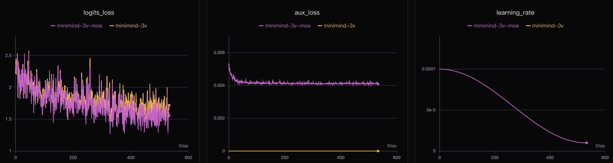
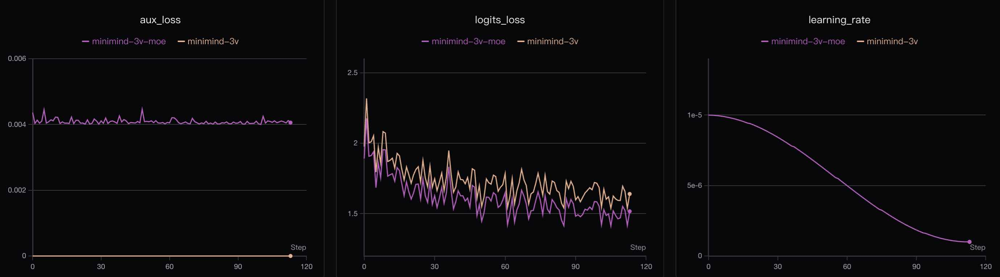
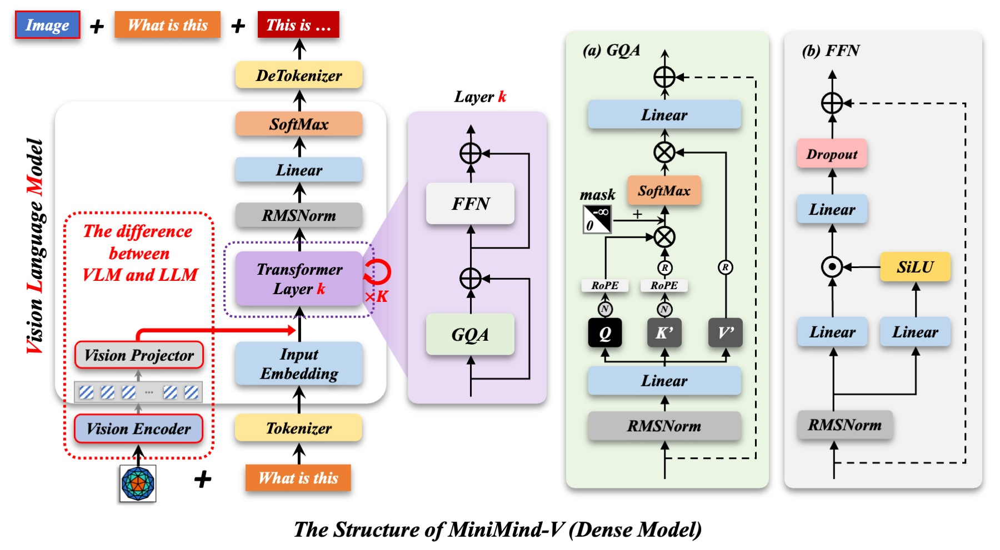

# Model Training

This page introduces how to train MiniMind-V vision-language models from scratch.

## 📊 Data Preparation

### 1. Download Dataset

Download datasets from the following addresses:

- [ModelScope - minimind-v_dataset](https://www.modelscope.cn/datasets/gongjy/minimind-v_dataset)
- [HuggingFace - minimind-v_dataset](https://huggingface.co/datasets/jingyaogong/minimind-v_dataset)

Create `./dataset` directory and place data files:

```bash
./dataset/
├── pretrain_i2t.parquet           # Pretrain data (~1.27M samples)
├── sft_i2t.parquet                # SFT data (~2.9M samples, includes Pretrain as subset)
├── eval_images/                   # Test images
│   ├── image-01-golden-dog-balloons.jpg
│   ├── image-02-rainbow-umbrella-street.jpg
│   └── ...
```

!!! tip "Dataset Notes"
    - `*.parquet` files contain conversations, image_bytes, and image_names columns
    - All images are embedded in the parquet files, no separate extraction needed
    - Please reserve about 2GB space for the dataset
    - If space is insufficient, try skipping pretrain and go directly to SFT training

### 2. Data Format

**Pretrain Data Format** (`pretrain_i2t.parquet`):

```text
Columns: conversations (json string), image_bytes (binary), image_names (string)

conversations example:
[
  {"role": "user", "content": "Provide a brief description of the given image.\n<image>"},
  {"role": "assistant", "content": "Olive oil is a healthy ingredient for free use."}
]
image_bytes: <binary image data>
```

**Single-Image SFT Data Format** (`sft_i2t.parquet`):

```text
Columns: conversations (json string), image_bytes (binary), image_names (string)

conversations example:
[
  {"role": "user", "content": "What impact does the location of the alarm clock have on sleep quality?<image>"},
  {"role": "assistant", "content": "Place the digital alarm clock on the nightstand..."}
]
image_bytes: <binary image data>
```

### 3. Data Source

All image-text data come from the [ALLaVA-4V](https://huggingface.co/datasets/FreedomIntelligence/ALLaVA-4V) family, natively paired in Chinese and English.

- **Pretrain Data** (`pretrain_i2t.parquet`, ~1.27M rows / ~640K unique images)
  - `ALLaVA-Caption-LAION-4V` en/zh + `ALLaVA-Caption-VFLAN-4V` en/zh
  - Single-turn caption descriptions for basic visual-to-language alignment
  
- **SFT Data** (`sft_i2t.parquet`, ~2.90M rows / ~650K unique images)
  - `ALLaVA-Instruct-LAION-4V` en/zh + `ALLaVA-Instruct-VFLAN-4V` en/zh
  - Synthesized instructions by Gemini/Claude (~50K) + GPT-4o iterative (~50K)
  - Pure-text conversations (~230K, with 8×8 black placeholder images)
  - **Full Pretrain caption data merged in** (~1.27M)
  - Pretrain stage can be skipped entirely (SFT has absorbed it as a subset)

## 🎯 Training Pipeline

All training scripts are located in the `./trainer` directory.

### Step 0: Prepare Base Language Model

Download pure language model weights to the `./out` directory (as the base language model for training VLM):

```bash
# Download 768-dim model
wget https://huggingface.co/jingyaogong/minimind-3v-pytorch/blob/main/llm_768.pth
```

### Step 1: Pretraining (Learning Image Description)

The pretraining stage teaches the model general image knowledge, such as a deer is a deer, a dog is a dog.

```bash
# Basic training command (start from LLM weights, train vision_proj only)
python trainer/train_pretrain_vlm.py --epochs 4 --from_weight llm

# Multi-GPU training
torchrun --nproc_per_node 2 trainer/train_pretrain_vlm.py --epochs 4 --from_weight llm

# Resume training from checkpoint
python trainer/train_pretrain_vlm.py --epochs 4 --from_resume 1
```

**Output weights**: `./out/pretrain_vlm_*.pth` (* is the model dimension, default is 768)

!!! info "Training Duration"
    Pretrain data volume is ~45% of SFT's, so one epoch can be roughly scaled by that ratio.

**Training Strategy**:
- Freeze Visual Encoder (SigLIP2 model) gradients
- Fully freeze LLM, train only Projection (`--freeze_llm 2`, Pretrain default)

**Key Parameters**:
- `--from_weight llm`: Start from LLM weights
- `--freeze_llm 2`: Freeze LLM parameters, train only Projection (pretrain default)
- `--from_resume 1`: Resume from checkpoint
- `--save_weight pretrain_vlm`: Save weight prefix name

**Loss Curve**:



### Step 2: Supervised Fine-Tuning (Learning Image-Caption Dialogue Style)

The SFT stage teaches the model real image-text dialogue format, better aligning with human communication habits.

```bash
# Basic training command (start from pretrain weights, full parameter fine-tuning)
python trainer/train_sft_vlm.py --epochs 2 --from_weight pretrain_vlm

# Multi-GPU training
torchrun --nproc_per_node 2 trainer/train_sft_vlm.py --epochs 2 --from_weight pretrain_vlm

# Resume training from checkpoint
python trainer/train_sft_vlm.py --epochs 4 --from_resume 1
```

**Output weights**: `./out/sft_vlm_*.pth`

!!! info "Training Duration"
    - minimind-3v (67M): ~2h per epoch (single 3090)
    - Dense and MoE finish in similar time (activated parameters on the same order)

**Training Strategy**:
- Freeze Visual Encoder (SigLIP2 model) gradients
- Train Vision Projection layer (all parameters learnable)
- Unfreeze first + last LLM layers (`--freeze_llm 1`, SFT default), keep middle layers frozen

**Key Parameters**:
- `--from_weight pretrain_vlm`: Start from pretrain weights
- `--from_resume 1`: Resume from checkpoint
- `--save_weight sft_vlm`: Save weight prefix name

**Loss Curve**:



### Step 3 (Optional): Multi-Image Fine-Tuning

Multi-image fine-tuning provides a demo example based on bird comparison dataset.

```bash
python train_sft_vlm.py --epochs 4 --use_multi_image
```

**Notes**:
- Multi-image dataset is relatively small and contains English conversations
- Only includes two-image comparison scenarios
- Fine-tuning effect is limited, provided as a reference approach

!!! warning "Training Notes"
    **Training Features:**
    
    - **Checkpoint Resumption**: Add `--from_resume 1` parameter to continue from last interruption
    - **GPU Count Changes**: Automatically convert steps when GPU count changes during resumption
    - **Atomic Saving**: Use temporary file + replacement mechanism to prevent weight corruption
    - **Dual File System**: Each save generates `out/**.pth` (model weights) and `checkpoints/**_resume.pth` (training state)
    
    **Resume Example:**
    ```bash
    # Resume training after interruption
    python trainer/train_sft_vlm.py --epochs 4 --from_resume 1
    ```

## 📈 Model Architecture Details

MiniMind-V's structure only adds Visual Encoder and feature projection submodules:



### Core Components

1. **Visual Encoder**
   - Uses [siglip2-base-p16-ve](https://huggingface.co/jingyaogong/siglip2-base-p16-ve)
   - Based on ViT-B/16 architecture
   - Patch size: 16×16
   - Output: up to 256×768 dimensional features

2. **Projection Layer**
   - LayerNorm + 2D pixel-shuffle reshape: concat 4 adjacent tokens (256×768 → 64×3072)
   - 2-layer MLP (Linear→GELU→Linear): project to LLM hidden dimension
   - Result: 64 visual tokens aligned to text embedding space

3. **Language Model**
   - Fully inherits from MiniMind
   - Minimal modifications (core algorithm changes < 50 lines)

### Input-Output Mechanism

**Input Format**:

In `minimind-v`, 64 `<|image_pad|>` tokens are used as placeholders to replace the image:

```text
<|image_pad|><|image_pad|>...<|image_pad|>(×64)\nWhat is this image describing?
```

Why 64 tokens? Because 256 SigLIP2 patch features are compressed to 64 tokens via reshape (concat 4 adjacent tokens) + MLP projection.


**Multi-Image Implementation**:

Achieved by injecting multiple `<image>` placeholders, no framework modification needed.

### Model Parameter Configuration

| Model Name | Params | d_model | n_layers | kv_heads | q_heads | Visual Token |
|-----------|--------|---------|----------|----------|---------|--------------|
| minimind-3v | 67M | 768 | 8 | 4 | 8 | 64×768 |
| minimind-3v-moe | 201M-A67M | 768 | 8 | 4 | 8 | 64×768 |

## 🧪 Test Model

### Test Trained Model

Ensure the model `*.pth` file to be tested is in the `./out/` directory.

```bash
# Test SFT model (default)
python eval_vlm.py --weight sft_vlm

# Test pretrain model
python eval_vlm.py --weight pretrain_vlm

# Specify image directory
python eval_vlm.py --weight sft_vlm --image_dir ./dataset/eval_images/
```

### Use Pre-Trained Model

You can also directly download and use pre-trained `*.pth` files:

- [HuggingFace - minimind-3v-pytorch](https://huggingface.co/jingyaogong/minimind-3v-pytorch)
- [ModelScope - minimind-3v-pytorch](https://www.modelscope.cn/models/gongjy/minimind-3v-pytorch)

## 🔧 Multi-GPU Training

### DDP Method

```bash
torchrun --nproc_per_node N train_xxx.py
```

### DeepSpeed Method

```bash
deepspeed --master_port 29500 --num_gpus=N train_xxx.py
```

### Wandb Monitoring

```bash
# Login first
wandb login

# Enable wandb
torchrun --nproc_per_node N train_xxx.py --use_wandb
```

By adding the `--use_wandb` parameter, you can log the training process. After training, you can view the process on the wandb website.

You can specify the project name and run name by modifying `wandb_project` and `wandb_run_name` parameters.

## 💰 Training Cost

Based on single NVIDIA 3090:

| Dataset Combination | Training Time | Cost (Approx.) | Effect |
|---------------------|---------------|----------------|--------|
| sft (1 epoch, Pretrain included as subset) | ~2h | ≈2.6 RMB | 😊😊😊😊 Good dialogue |
| pretrain (1 epoch) + sft (1 epoch) | ~3h | ≈4 RMB | 😊😊😊😊😊 Better convergence |

!!! success "Quick Reproduction"
    Single 3090 only needs **~2 hours + ~2.6 RMB** to train a vision-language ChatBot!

## 📝 Training Tips

### 1. Reduce Memory Usage

- Use smaller batch size
- Use the dense model instead of moe
- Enable gradient checkpointing (if implemented)
- Use DeepSpeed ZeRO optimization

### 2. Accelerate Training

- Use multi-GPU training (DDP or DeepSpeed)
- Use mixed precision training (bfloat16)
- Reduce image resolution (but may affect performance)

### 3. Improve Performance

- Increase training epochs
- Use moe model for better performance
- Use higher quality datasets
- Adjust learning rate

### 4. Checkpoint Resumption

MiniMind-V now supports complete checkpoint resumption:

- **Automatic Saving**: Training state saved every N steps (default 100)
- **Easy Resumption**: Just add `--from_resume 1` to continue training
- **GPU Flexibility**: Automatically adapts when GPU count changes
- **Safe Storage**: Atomic file operations prevent corruption

**Usage Example:**
```bash
# Start training
python trainer/train_sft_vlm.py --epochs 10

# Training interrupted at epoch 5...
# Resume from checkpoint
python trainer/train_sft_vlm.py --epochs 10 --from_resume 1

# Resume with different GPU count (4 GPUs -> 2 GPUs)
torchrun --nproc_per_node 2 trainer/train_sft_vlm.py --epochs 10 --from_resume 1
```

## 🎓 Core Principles

### Why Pretraining?

Pretraining teaches the model basic image description capabilities, establishing fundamental mapping relationships between image features and text.

### Why SFT?

SFT teaches the model real dialogue formats, making its outputs more aligned with human communication habits rather than simple image descriptions.

### Why Freeze SigLIP2?

SigLIP2 is already a powerful pre-trained visual encoder. Freezing its parameters can:
- Significantly reduce trainable parameters
- Speed up training
- Prevent overfitting
- Lower training costs

### Future Improvement Directions

```text
> Use larger SigLIP2 models for finer-grained image features
> Further explore dynamic resolution enabled by NaFlex
> Expand multi-image datasets to support more complex multi-image understanding scenarios
> Explore more advanced Projection designs for better cross-modal alignment
```

## 📚 Related Resources

- **Base Language Model**: [MiniMind](https://github.com/jingyaogong/minimind)
- **Reference Paper**: [LlaVA](https://arxiv.org/pdf/2304.08485)
- **Visual Encoder**: [SigLIP2](https://huggingface.co/jingyaogong/siglip2-base-p16-ve)

## ❓ Common Issues

### 1. Out of memory during training?

- Reduce batch_size
- Use the dense model
- Use DeepSpeed ZeRO
- Single-GPU training instead of multi-GPU

### 2. Training loss not decreasing?

- Check if dataset path is correct
- Check if learning rate is appropriate
- Confirm base LLM model is loaded correctly
- Check for gradient explosion/vanishing

### 3. Multi-GPU training error?

- Ensure all GPUs are visible and CUDA versions are consistent
- Check if port is occupied (modify `--master_port`)
- Try using DeepSpeed instead of DDP

### 4. How to use custom dataset?

Prepare parquet files according to the data format above, and modify the data path in the training script.

## 🎯 Next Steps

Congratulations! You've learned the complete training process of MiniMind-V. Now you can:

- Start training your own vision-language model
- Try using different datasets
- Explore the source code implementation
- Contribute your improvements to the project
